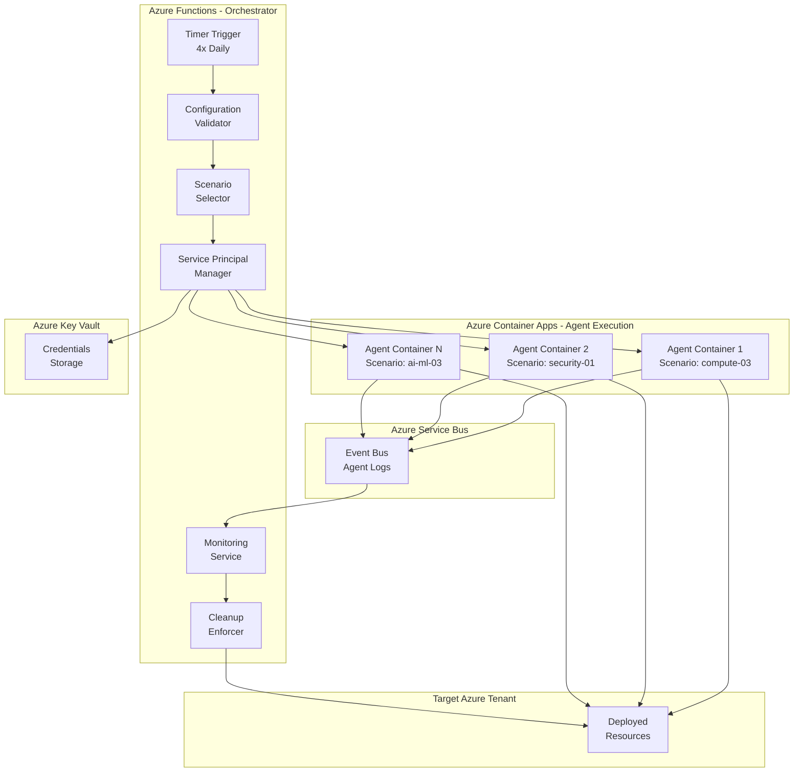
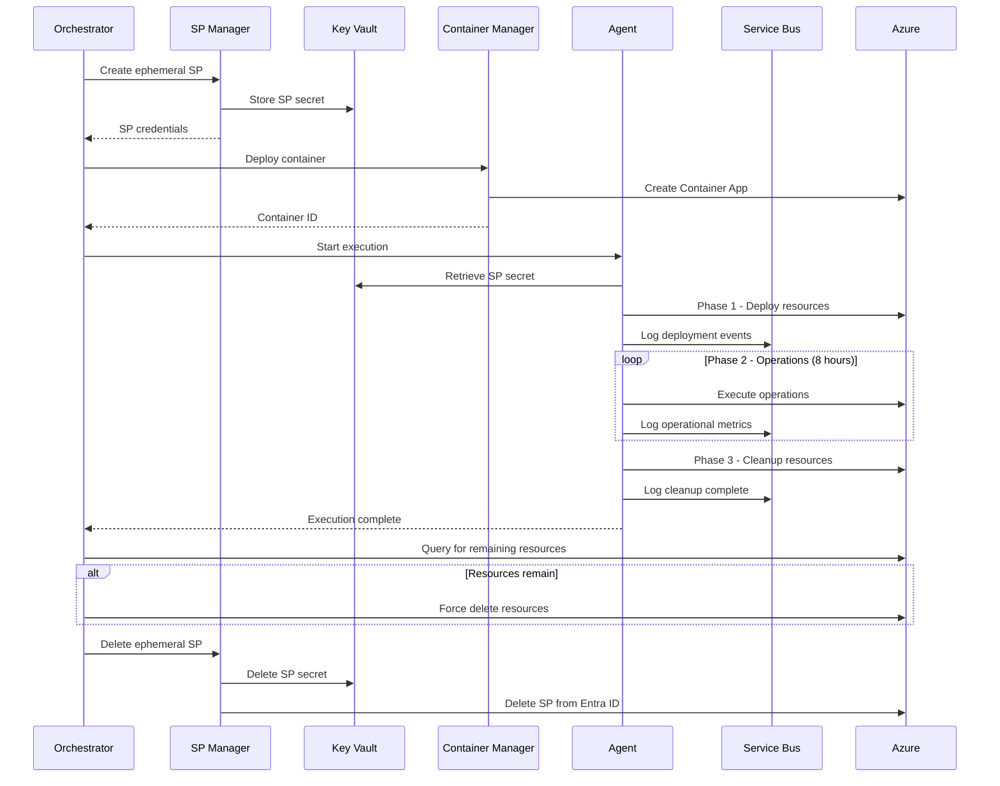
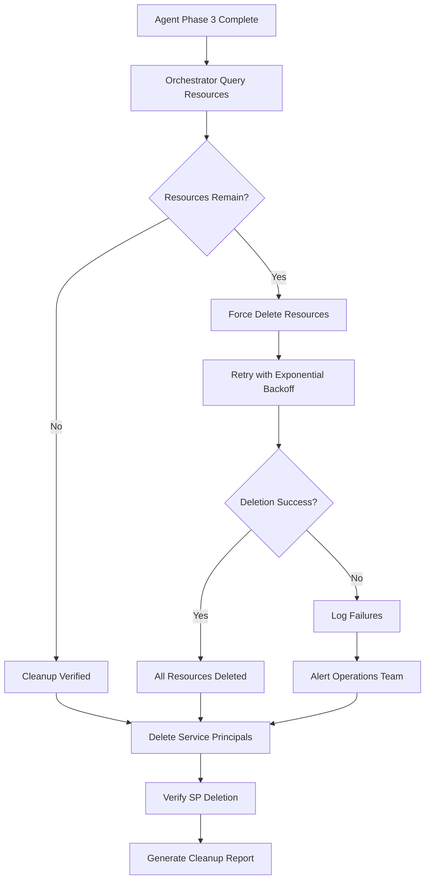
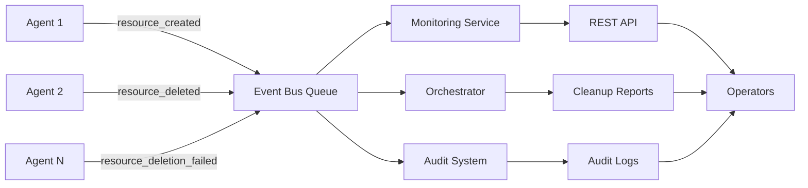
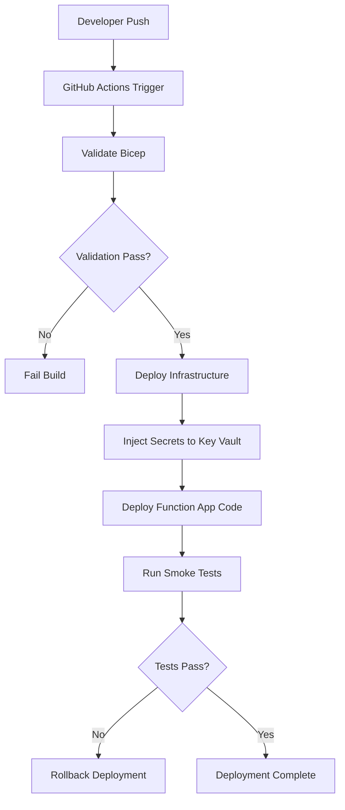

# Azure HayMaker Orchestration Service - Architecture Guide

This guide documents the architecture of the Azure HayMaker orchestration service, not Azure services in general. For Azure service architecture patterns, see the [Azure Architecture Center](https://learn.microsoft.com/azure/architecture/).

## Table of Contents

- [Overview](#overview)
- [System Architecture](#system-architecture)
- [Core Components](#core-components)
- [Agent Lifecycle](#agent-lifecycle)
- [Service Principal Management](#service-principal-management)
- [Cleanup Verification](#cleanup-verification)
- [Data Flow](#data-flow)
- [Security Architecture](#security-architecture)
- [Deployment Model](#deployment-model)
- [Design Decisions](#design-decisions)
- [API Architecture](#api-architecture)
- [Configuration Management](#configuration-management)
- [References](#references)

## Overview

**Azure HayMaker** is an orchestration service that generates benign telemetry to simulate ordinary Azure tenant operations. The system executes multiple concurrent scenarios, each managed by an autonomous goal-seeking agent operating with dedicated credentials in isolated container environments.

### Purpose

- Generate realistic Azure tenant activity for testing and monitoring
- Execute 50+ distinct operational scenarios across 10 Azure technology areas
- Simulate real-world deployment, operation, and cleanup patterns
- Provide comprehensive telemetry for security operations center (SOC) testing

### Core Principles

1. **Zero-BS Philosophy**: Every component implements real functionality with no stubs, TODOs, or placeholders
2. **Goal-Seeking Agents**: Autonomous agents resolve problems encountered during execution using Claude AI
3. **Complete Cleanup**: All resources are tracked, verified, and removed after execution
4. **Single Tenant Scope**: All operations constrained to one Azure tenant and subscription
5. **Observable Operations**: Comprehensive logging and monitoring at every level

## System Architecture

### High-Level Architecture



### Component Overview

Azure HayMaker is designed around five primary components:

1. **Orchestrator Service** (Azure Functions)
   - Schedules and coordinates scenario execution
   - Manages service principal lifecycle
   - Enforces cleanup policies
   - Provides monitoring APIs

2. **Agent Containers** (Azure Container Apps)
   - Execute individual scenarios in isolated environments
   - Generate operational telemetry
   - Self-heal using Claude AI goal-seeking
   - Report status via Service Bus

3. **Event Bus** (Azure Service Bus)
   - Collects logs from all agents
   - Provides audit trail
   - Enables real-time monitoring
   - Supports message persistence (7 days)

4. **Configuration Store** (Azure Key Vault)
   - Securely stores credentials
   - Manages service principal secrets
   - Provides configuration values
   - Supports automatic credential rotation

5. **Scenario Repository** (Filesystem/Git)
   - 50+ documented scenarios
   - Scenario template
   - Reference architectures
   - Version controlled in Git

## Core Components

### Orchestrator Service

**Technology**: Azure Functions (Python 3.13)

**Triggers**:
- **Timer Trigger**: Executes 4 times daily (global regions)
- **HTTP Triggers**: Monitoring APIs, on-demand execution

**Modules**:

#### Configuration Management (`config.py`)
- Loads configuration from environment variables, Azure Key Vault, or .env file
- Validates all required settings
- Priority order: Environment variables > Key Vault > .env file
- See: [Microsoft Learn - Azure Functions Configuration](https://learn.microsoft.com/azure/azure-functions/functions-app-settings)

#### Scenario Selector (`scenario_selector.py`)
- Lists available scenarios from `docs/scenarios/`
- Parses scenario metadata (technology area, description)
- Randomly selects scenarios based on simulation size (small=5, medium=15, large=30)
- Ensures no duplicate selections

#### Service Principal Manager (`sp_manager.py`)
- Creates ephemeral service principals for each scenario
- Assigns RBAC roles (Contributor, User Access Administrator)
- Stores secrets in Key Vault
- Deletes SPs after cleanup verification
- Verifies SP deletion completion
- See: [Microsoft Learn - Service Principals](https://learn.microsoft.com/entra/identity-platform/app-objects-and-service-principals)

#### Container Manager (`container_manager.py`)
- Deploys Azure Container Apps for scenario execution
- Enforces resource requirements (64GB RAM, 2 CPU minimum)
- Configures VNet integration (mandatory for security)
- Sets up Key Vault secret references
- Manages container lifecycle
- See: [Microsoft Learn - Azure Container Apps](https://learn.microsoft.com/azure/container-apps/)

#### Cleanup Module (`cleanup.py`)
- Queries Azure Resource Graph for managed resources
- Verifies all resources deleted after scenario
- Force deletes remaining resources
- Deletes service principals and secrets
- Generates cleanup reports
- See: [Microsoft Learn - Azure Resource Graph](https://learn.microsoft.com/azure/governance/resource-graph/)

#### Event Bus (`event_bus.py`)
- Publishes resource events to Service Bus
- Subscribes to agent logs
- Parses resource creation/deletion events
- Provides audit trail
- See: [Microsoft Learn - Azure Service Bus](https://learn.microsoft.com/azure/service-bus-messaging/)

#### Monitoring API (`monitoring_api.py`)
- **GET /api/v1/status**: Returns orchestrator status
- **GET /api/v1/runs/{run_id}**: Returns execution details
- **GET /api/v1/runs/{run_id}/resources**: Returns paginated resource list
- Standard error handling with trace IDs
- OpenAPI 3.0 compliant

### Agent Containers

**Technology**: Azure Container Apps (Python 3.13, Claude Code)

**Resources**:
- **Memory**: 64GB (enforced minimum)
- **CPU**: 2 cores (enforced minimum)
- **Storage**: Ephemeral disk for logs

**Runtime Environment**:
- Claude Code CLI with Anthropic API access
- Azure CLI, Terraform, Bicep installed
- Python runtime with azure-sdk packages
- Git for scenario document retrieval

**Execution Phases**:

1. **Phase 1 - Deployment** (30-60 minutes)
   - Load scenario document
   - Parse deployment instructions
   - Execute Azure CLI/Terraform/Bicep commands
   - Tag all resources with execution ID
   - Report deployment status

2. **Phase 2 - Operations** (8 hours)
   - Execute operational commands
   - Generate realistic telemetry
   - Monitor resource health
   - Report operational metrics

3. **Phase 3 - Cleanup** (30-60 minutes)
   - Delete all created resources
   - Verify deletion completion
   - Report cleanup status

**Error Handling**:
- Claude AI analyzes errors and suggests resolutions
- Autonomous retry with corrected commands
- Graceful failure if resolution not possible
- All errors logged to Service Bus

### Scenario Repository

**Location**: `docs/scenarios/`

**Structure**:
```
docs/scenarios/
├── SCENARIO_TEMPLATE.md          # Template for new scenarios
├── SCALING_PLAN.md               # Roadmap for expansion
├── [area]-[num]-[name].md        # 50+ scenario documents
```

**Scenario Format**: Markdown files with embedded bash code blocks

**Technology Areas** (5 scenarios each):
- AI & Machine Learning
- Analytics
- Compute
- Containers
- Databases
- Hybrid + Multicloud
- Identity
- Networking
- Security
- Web Apps

**Example**: `compute-03-app-service-python.md`

## Agent Lifecycle

### Complete Agent Lifecycle



### Orchestrator Execution Flow

1. **Configuration Validation**
   - Load configuration from environment/Key Vault/.env
   - Validate all required settings
   - Check Azure connectivity
   - Verify Key Vault access

2. **Scenario Selection**
   - Query available scenarios
   - Randomly select N scenarios (based on simulation size)
   - Parse scenario metadata
   - Validate scenario documents

3. **Service Principal Provisioning**
   - Create ephemeral SP for each scenario
   - Assign RBAC roles (subscription scope)
   - Store SP secret in Key Vault
   - Wait for role propagation (60 seconds)

4. **Container Deployment**
   - Generate container app name
   - Configure VNet integration
   - Set environment variables (Key Vault references)
   - Deploy to Azure Container Apps
   - Wait for container ready

5. **Monitoring Phase**
   - Subscribe to Service Bus agent logs
   - Track resource creation/deletion events
   - Monitor agent health
   - Detect agent failures
   - Update execution status

6. **Cleanup Verification**
   - Query Azure Resource Graph for tagged resources
   - Verify all resources deleted
   - Force delete remaining resources
   - Generate cleanup report

7. **Service Principal Cleanup**
   - Delete ephemeral SPs
   - Delete SP secrets from Key Vault
   - Verify SP deletion
   - Generate final report

## Service Principal Management

### SP Lifecycle

**Creation**:
1. Generate unique SP name: `AzureHayMaker-{scenario}-admin`
2. Create Entra ID application registration
3. Create service principal
4. Generate client secret
5. Store secret in Key Vault: `scenario-sp-{scenario}-secret`
6. Assign RBAC roles on subscription
7. Wait 60 seconds for role propagation

**Usage**:
- Agent retrieves secret from Key Vault via Managed Identity
- Agent authenticates to Azure using SP credentials
- Agent operates within assigned RBAC roles
- All operations logged to Azure Activity Log

**Deletion**:
1. Query Entra ID to find SP by name
2. Delete SP from Entra ID
3. Delete secret from Key Vault
4. Verify deletion completion
5. Log deletion event

### SP Security Model

**Principle**: Ephemeral credentials with least privilege

**Roles Assigned**:
- **Contributor**: Create/delete Azure resources
- **User Access Administrator**: Assign roles within scenario scope

**Scope**: Subscription-level (not tenant-level)

**Lifetime**: 8-12 hours (scenario execution duration)

**Secret Storage**:
- Secrets NEVER stored in code or logs
- Secrets stored only in Azure Key Vault
- Secrets passed via environment variable references
- Secrets cleared from memory after use

**See Also**:
- [Microsoft Learn - Azure RBAC](https://learn.microsoft.com/azure/role-based-access-control/)
- [Microsoft Learn - Key Vault Best Practices](https://learn.microsoft.com/azure/key-vault/general/best-practices)

## Cleanup Verification

### Tag-Based Resource Tracking

**Required Tags**:
```bash
AzureHayMaker-managed=true
Scenario=[scenario-id]
Owner=AzureHayMaker
ExecutionId=[unique-execution-id]
CreatedAt=[timestamp]
```

**Purpose**:
- Identify all HayMaker-created resources
- Enable cleanup verification queries
- Support cost tracking
- Facilitate audit

### Cleanup Process



### Verification Steps

1. **Query Tagged Resources**
   - Use Azure Resource Graph API
   - Filter by execution ID and HayMaker tags
   - Return list of remaining resources

2. **Force Deletion**
   - Iterate through remaining resources
   - Attempt deletion with retry logic
   - Handle dependency conflicts
   - Log all deletion attempts

3. **Retry Logic**
   - Exponential backoff: 1s, 2s, 4s, 8s, 16s, 32s, 60s (max)
   - Detect dependency errors
   - Skip already-deleted resources
   - Max 7 attempts per resource

4. **SP Cleanup**
   - Delete all scenario service principals
   - Delete SP secrets from Key Vault
   - Verify deletion via Entra ID query
   - Log any failures for manual cleanup

5. **Report Generation**
   - Total resources expected
   - Total resources deleted
   - Failed deletions with error details
   - SP deletion status
   - Cleanup verification timestamp

**See Also**:
- [Microsoft Learn - Azure Resource Manager](https://learn.microsoft.com/azure/azure-resource-manager/management/overview)

## Data Flow

### Logging Data Flow



### Event Types

**Resource Events**:
- `resource_created`: Resource successfully deployed
- `resource_deleted`: Resource successfully removed
- `resource_deletion_failed`: Deletion attempt failed

**Agent Events**:
- `phase_started`: Agent phase begun
- `phase_completed`: Agent phase finished
- `error_encountered`: Agent encountered error
- `error_resolved`: Agent resolved error autonomously

**Orchestrator Events**:
- `execution_started`: Orchestration begun
- `scenario_selected`: Scenarios chosen
- `sp_created`: Service principal provisioned
- `container_deployed`: Agent container started
- `cleanup_verified`: All resources deleted
- `execution_completed`: Orchestration finished

## Security Architecture

### Threat Model

**Assumptions**:
- Azure tenant is test/dev environment (not production)
- Operators trust the orchestrator service
- Service principals have limited scope (single subscription)
- No malicious scenarios in repository

**Threats & Mitigations**:

1. **Credential Leakage**
   - Threat: SP secrets exposed in logs or errors
   - Mitigation: Credential scrubbing, Key Vault storage, secure env vars

2. **Privilege Escalation**
   - Threat: Scenario SPs gain excessive permissions
   - Mitigation: Strict role assignment, time-limited SPs, audit logging

3. **Resource Leakage**
   - Threat: Resources not cleaned up, accumulating costs
   - Mitigation: Forced cleanup verification, cost alerts, tag-based queries

4. **Lateral Movement**
   - Threat: Compromised agent affects other resources
   - Mitigation: Isolated containers, scoped credentials, network policies

5. **Data Exfiltration**
   - Threat: Agents extract sensitive data
   - Mitigation: Benign-only scenarios, network egress controls, audit logs

### Security Controls

**Credential Management**:
- Main SP credentials in Key Vault
- Scenario SP credentials ephemeral
- Credentials never logged
- Credentials cleared from memory
- Automatic invalidation after scenario

**Least Privilege**:
- Subscription-scoped roles only
- No Global Administrator or privileged roles
- Time-limited (12 hours max)
- Deleted immediately after scenario

**Network Security**:
- VNet integration mandatory
- Private endpoints for PaaS services
- Network policies for container egress
- Only HTTPS/443 allowed outbound

**Audit Logging**:
- All SP creation/deletion logged
- All role assignments logged
- All resource operations logged
- All errors and exceptions logged
- Event Bus messages retained 7 days
- Azure Activity Log retained 90 days

**See Also**:
- [Microsoft Learn - Azure Security Best Practices](https://learn.microsoft.com/azure/security/fundamentals/best-practices-and-patterns)
- [Microsoft Learn - Azure Defender](https://learn.microsoft.com/azure/defender-for-cloud/)

## Deployment Model

### Infrastructure as Code

**Technology**: Azure Bicep

**Deployment**: GitHub Actions with OIDC authentication

**Environments**: dev, staging, prod

**Bicep Modules**:
- `main.bicep`: Root orchestration template
- `modules/log-analytics.bicep`: Monitoring workspace
- `modules/storage.bicep`: Blob storage for logs/reports
- `modules/service-bus.bicep`: Event bus topic
- `modules/key-vault.bicep`: Credential storage
- `modules/cosmos-db.bicep`: Metrics database
- `modules/container-apps-env.bicep`: Container Apps environment
- `modules/function-app.bicep`: Orchestrator deployment

**Parameters**: `parameters/{environment}.bicepparam`

**See Also**:
- [Microsoft Learn - Azure Bicep](https://learn.microsoft.com/azure/azure-resource-manager/bicep/)
- [Microsoft Learn - GitHub Actions for Azure](https://learn.microsoft.com/azure/developer/github/github-actions)

### GitOps Workflow



### Deployment Steps

1. **Validate Bicep Templates**
   - `az bicep build --file infra/bicep/main.bicep`
   - Check for syntax errors
   - Validate parameter files

2. **Deploy Infrastructure**
   - `az deployment sub create`
   - Deploy to subscription scope
   - Create all Azure resources

3. **Inject Secrets**
   - Store main SP credentials in Key Vault
   - Store Anthropic API key in Key Vault
   - Set Function App Key Vault references

4. **Deploy Function App**
   - Build Python package
   - Deploy to Azure Functions
   - Validate function endpoints

5. **Run Smoke Tests**
   - Test function app health endpoint
   - Verify Key Vault connectivity
   - Check Service Bus accessibility

**See Also**:
- [Microsoft Learn - Azure Functions Deployment](https://learn.microsoft.com/azure/azure-functions/functions-deployment-technologies)

## Design Decisions

### Decision 1: Azure Functions vs. Container Apps for Orchestrator

**Chosen**: Azure Functions (Timer Trigger)

**Rationale**:
- Built-in timer trigger for 4x daily execution
- Pay-per-execution cost model
- Serverless (no infrastructure management)
- Native Azure SDK support
- Straightforward deployment

**See**: [Microsoft Learn - Azure Functions](https://learn.microsoft.com/azure/azure-functions/)

### Decision 2: Azure Service Bus vs. Event Hubs

**Chosen**: Azure Service Bus (Queue)

**Rationale**:
- Guaranteed FIFO for agent logs
- 7-day message retention for audit
- At-least-once delivery guarantee
- Simple queue model
- Appropriate for message volume

**See**: [Microsoft Learn - Choose Between Service Bus and Event Hubs](https://learn.microsoft.com/azure/service-bus-messaging/compare-messaging-services)

### Decision 3: Ephemeral vs. Persistent Service Principals

**Chosen**: Ephemeral (created per execution, deleted after)

**Rationale**:
- Minimizes credential lifetime and exposure
- Each execution gets fresh credentials
- Credentials automatically invalidated after scenario
- Clear association between SP and scenario execution

**See**: [Microsoft Learn - Application and Service Principal Lifecycle](https://learn.microsoft.com/entra/identity-platform/app-objects-and-service-principals)

### Decision 4: Scenario Format - Markdown vs. YAML

**Chosen**: Markdown with embedded bash code blocks

**Rationale**:
- Human-readable documentation
- Scenario context and commands in one file
- Claude AI can easily parse and extract commands
- Git-friendly format with clear diffs
- Doubles as reference documentation

### Decision 5: Cleanup Strategy - Agent-Only vs. Orchestrator-Enforced

**Chosen**: Orchestrator-Enforced with Tag-Based Verification

**Rationale**:
- Ensures cleanup happens even if agent fails
- Prevents resource leaks
- Orchestrator validates cleanup completion
- Force-deletes anything agent misses

## API Architecture

### Monitoring API

**Base URL**: `https://{function-app}.azurewebsites.net/api/v1`

**Authentication**: Azure AD tokens or API keys

**Endpoints**:

#### GET /status
Returns current orchestrator status

**Response**:
```json
{
  "status": "running",
  "health": "healthy",
  "current_run_id": "550e8400-e29b-41d4-a716-446655440000",
  "started_at": "2025-01-15T10:00:00Z",
  "phase": "monitoring",
  "scenarios_count": 15,
  "scenarios_completed": 5,
  "scenarios_running": 10,
  "scenarios_failed": 0,
  "next_scheduled_run": "2025-01-15T16:00:00Z"
}
```

#### GET /runs/{run_id}
Returns detailed execution information

**Response**:
```json
{
  "run_id": "550e8400-e29b-41d4-a716-446655440000",
  "started_at": "2025-01-15T10:00:00Z",
  "ended_at": "2025-01-15T18:30:00Z",
  "status": "completed",
  "phase": "completed",
  "simulation_size": "medium",
  "scenarios": [...],
  "total_resources": 47,
  "total_service_principals": 15,
  "cleanup_verification": {...}
}
```

#### GET /runs/{run_id}/resources
Returns paginated list of resources

**Query Parameters**:
- `page` (default: 1)
- `page_size` (default: 100, max: 500)
- `scenario_name` (optional filter)
- `resource_type` (optional filter)
- `status` (optional filter)

**Response**:
```json
{
  "run_id": "550e8400-e29b-41d4-a716-446655440000",
  "resources": [...],
  "pagination": {
    "page": 1,
    "page_size": 100,
    "total_items": 47,
    "total_pages": 1,
    "has_next": false,
    "has_previous": false
  }
}
```

**Error Format**:
```json
{
  "error": {
    "code": "ERROR_CODE",
    "message": "Human-readable message",
    "trace_id": "unique-request-id"
  }
}
```

**See Also**:
- [Microsoft Learn - Azure Functions HTTP Trigger](https://learn.microsoft.com/azure/azure-functions/functions-bindings-http-webhook-trigger)

## Configuration Management

### Configuration Priority

Azure HayMaker uses tiered configuration:

1. **Environment Variables** (highest priority) - Explicit overrides
2. **Azure Key Vault** (production) - Secure secret storage
3. **.env File** (local development) - Developer convenience

### Configuration Loading

**Process**:
1. Check for environment variable
2. If not found, check Key Vault
3. If not found, check .env file
4. If not found, raise ConfigurationError

**Security**:
- Production deployments use Key Vault
- Local development uses .env file
- .env file logs WARNING in production
- All secrets stored in Key Vault

**Example**:
```python
from azure_haymaker.orchestrator.config import load_config_from_env_and_keyvault

config = await load_config_from_env_and_keyvault()
```

**See Also**:
- [Microsoft Learn - Azure Functions App Settings](https://learn.microsoft.com/azure/azure-functions/functions-app-settings)
- [Microsoft Learn - Key Vault References](https://learn.microsoft.com/azure/app-service/app-service-key-vault-references)

## References

### Azure HayMaker Documentation

- [Project README](../../../../README.md) - Getting started guide
- [Architecture Documentation](../../../../docs/ARCHITECTURE.md) - Full system architecture
- [Scenario Management](../../../../docs/SCENARIO_MANAGEMENT.md) - Scenario lifecycle
- [Module Specifications](../../../../specs/MODULE_SPECIFICATIONS.md) - Implementation specs

### Azure Services

- [Azure Functions](https://learn.microsoft.com/azure/azure-functions/) - Serverless compute for orchestrator
- [Azure Container Apps](https://learn.microsoft.com/azure/container-apps/) - Agent execution environment
- [Azure Service Bus](https://learn.microsoft.com/azure/service-bus-messaging/) - Event streaming and queuing
- [Azure Key Vault](https://learn.microsoft.com/azure/key-vault/) - Secret management
- [Azure Resource Graph](https://learn.microsoft.com/azure/governance/resource-graph/) - Resource querying
- [Azure Cosmos DB](https://learn.microsoft.com/azure/cosmos-db/) - NoSQL database for metrics
- [Azure Table Storage](https://learn.microsoft.com/azure/storage/tables/) - Structured state storage
- [Azure Blob Storage](https://learn.microsoft.com/azure/storage/blobs/) - Log and report storage
- [Azure Log Analytics](https://learn.microsoft.com/azure/azure-monitor/logs/) - Monitoring and analytics

### Infrastructure as Code

- [Azure Bicep](https://learn.microsoft.com/azure/azure-resource-manager/bicep/) - Infrastructure as Code DSL
- [Bicep Modules](https://learn.microsoft.com/azure/azure-resource-manager/bicep/modules) - Reusable Bicep templates
- [Azure Resource Manager](https://learn.microsoft.com/azure/azure-resource-manager/management/overview) - Deployment service

### Authentication & Security

- [Azure Entra ID Service Principals](https://learn.microsoft.com/entra/identity-platform/app-objects-and-service-principals) - Service principal management
- [Azure RBAC](https://learn.microsoft.com/azure/role-based-access-control/) - Role-based access control
- [Azure Managed Identity](https://learn.microsoft.com/entra/identity/managed-identities-azure-resources/) - Passwordless authentication
- [GitHub OIDC with Azure](https://learn.microsoft.com/azure/developer/github/connect-from-azure) - Passwordless deployment
- [Azure Security Best Practices](https://learn.microsoft.com/azure/security/fundamentals/best-practices-and-patterns) - Security guidelines

### Development Tools

- [Azure CLI](https://learn.microsoft.com/cli/azure/) - Command-line interface
- [Terraform Azure Provider](https://registry.terraform.io/providers/hashicorp/azurerm/latest/docs) - Infrastructure as Code
- [Python Azure SDK](https://azure.github.io/azure-sdk/releases/latest/python.html) - Azure SDK for Python

---

**Version**: 2.0
**Last Updated**: 2025-01-15
**Focus**: Azure HayMaker Orchestration Service Architecture
