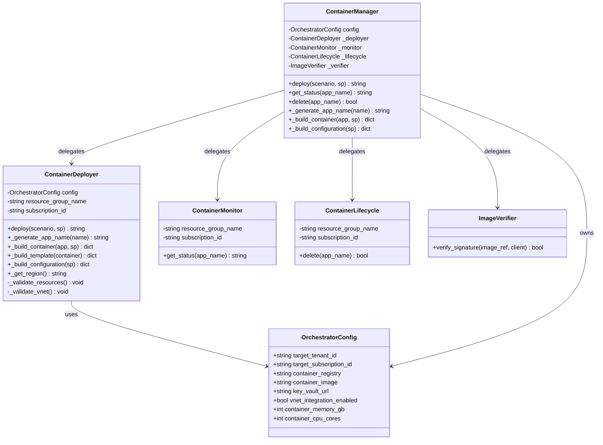
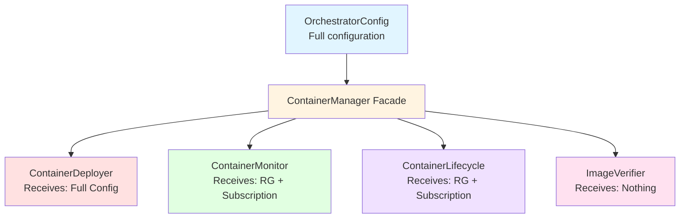
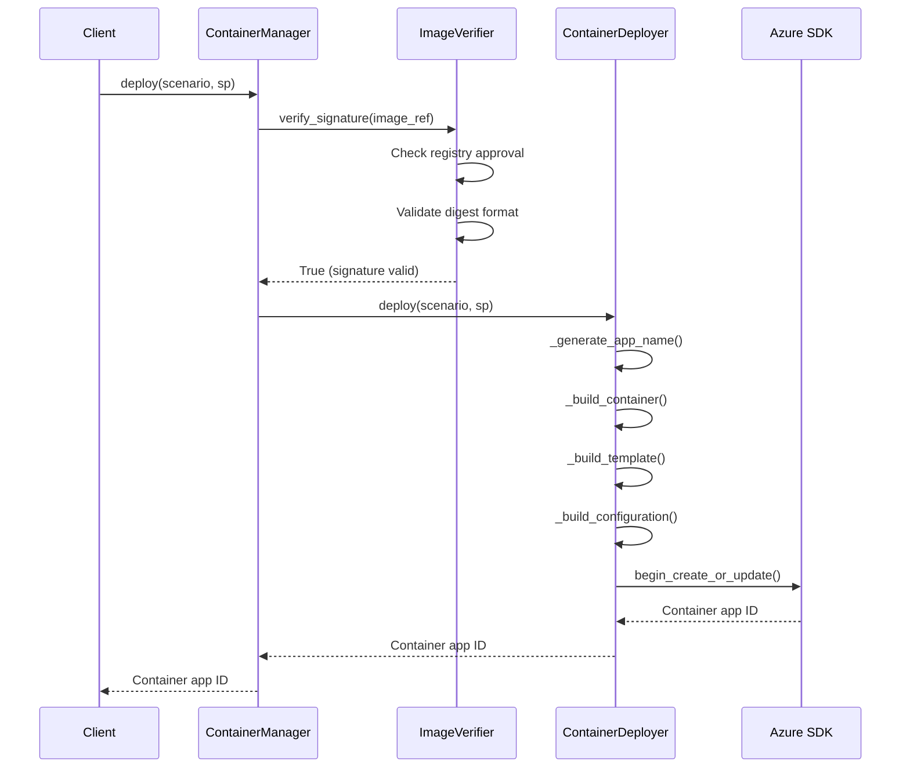
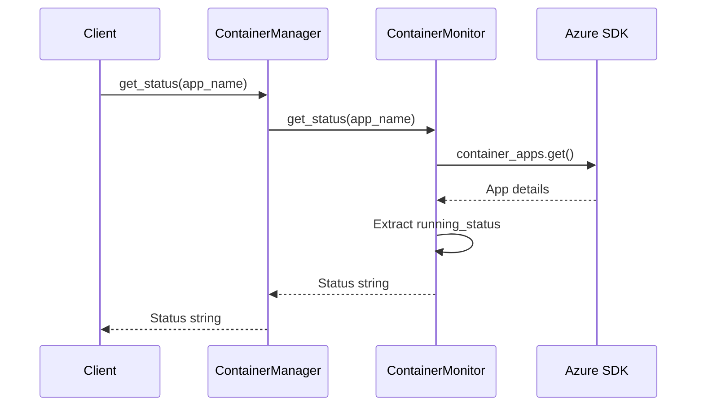
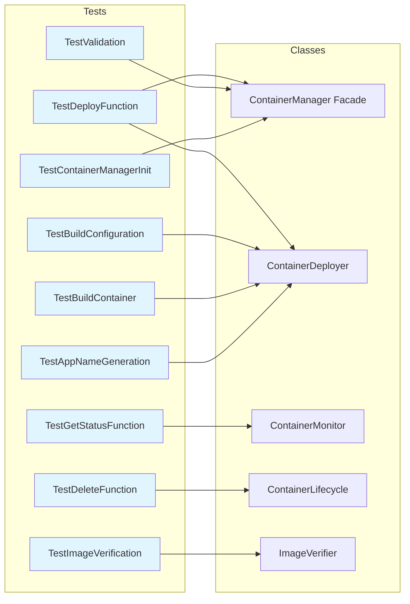
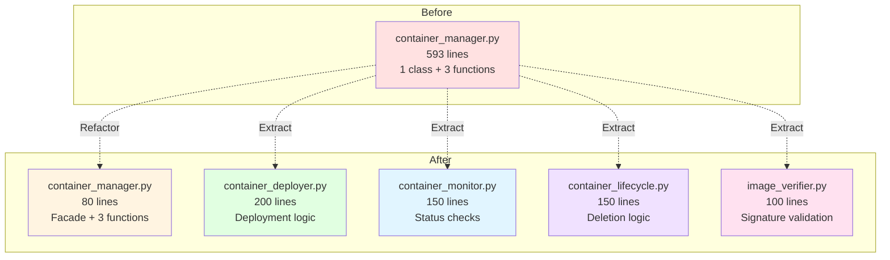
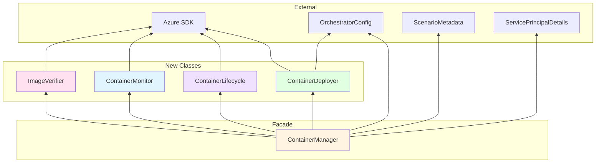
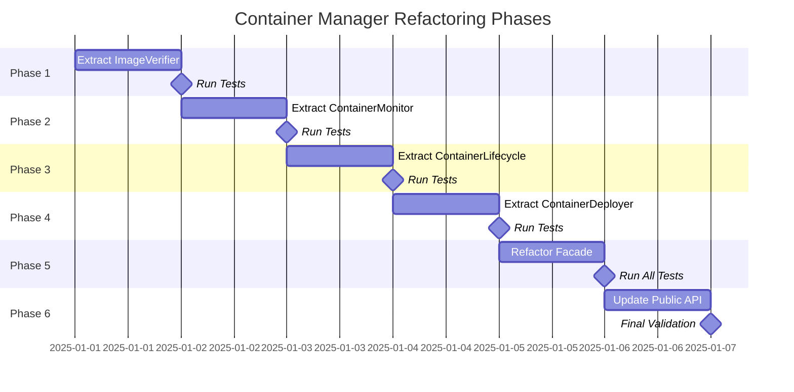
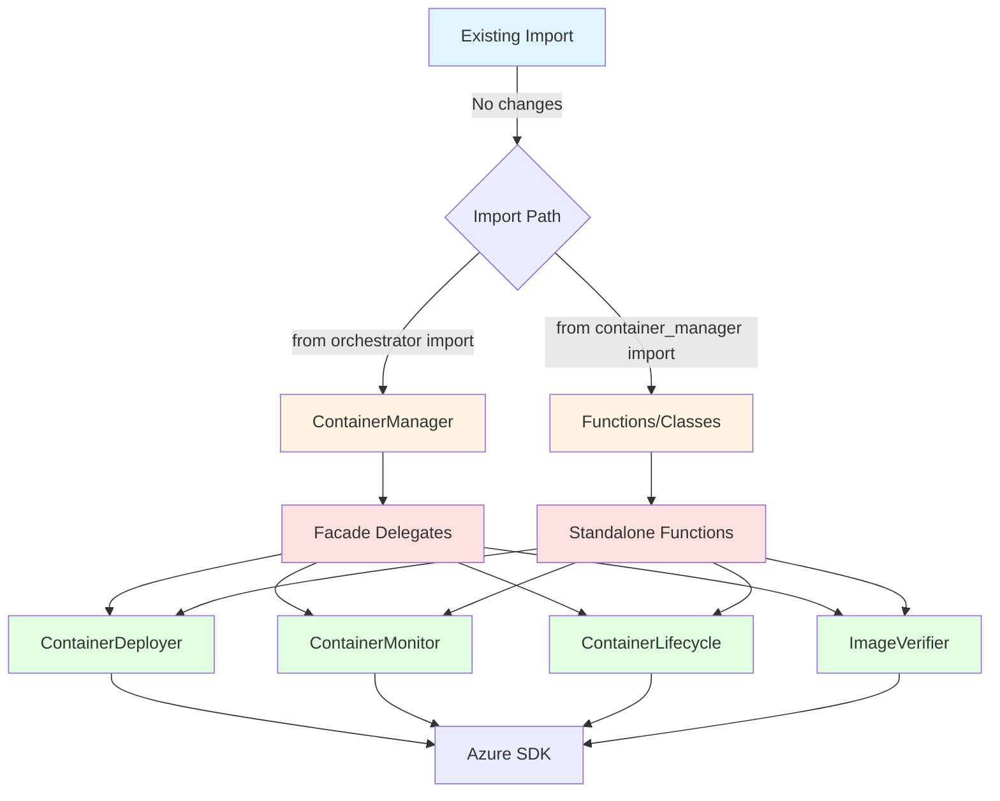
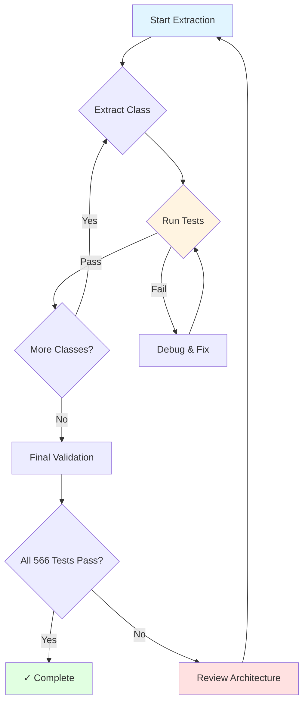

# Container Manager Architecture Diagrams

## 1. Class Structure and Delegation Flow

## 2. Configuration Injection Flow

## 3. Deployment Flow Sequence

## 4. Status Monitoring Flow

## 5. Test Coverage Mapping

## 6. File Structure Before and After

## 7. Dependency Graph

## 8. Implementation Phases

## 9. Backward Compatibility Strategy

## 10. Risk Mitigation Flow

---

## Key Insights from Diagrams

### Class Structure (Diagram 1)
- ContainerManager acts as a thin facade with minimal logic
- All specialized classes have clear, non-overlapping responsibilities
- Configuration flows from OrchestratorConfig to classes that need it

### Configuration Injection (Diagram 2)
- Deployer needs full config (10+ fields)
- Monitor and Lifecycle need only identifiers (2 fields)
- ImageVerifier is stateless (0 fields)
- **Design follows Interface Segregation Principle**

### Deployment Flow (Diagram 3)
- Image verification happens **before** deployment (security requirement)
- Deployer orchestrates multiple internal steps
- Clear separation between validation and deployment

### Test Coverage (Diagram 5)
- Tests map cleanly to specific classes
- Facade tests validate delegation
- Specialized class tests validate implementation
- **Zero test modifications needed**

### Implementation Phases (Diagram 8)
- Incremental extraction with test validation at each step
- Low-risk approach: stateless → minimal config → full config
- Milestone-driven with clear success criteria

### Backward Compatibility (Diagram 9)
- Multiple import paths continue working
- Facade maintains transparent delegation
- Standalone functions provide convenience wrappers
- **Zero breaking changes**

---

## Architecture Validation Questions

### Q1: Are responsibilities clearly separated?
**Yes**: Each class has one focused concern (verify, deploy, monitor, delete)

### Q2: Is configuration injection minimal?
**Yes**: Classes receive only what they need (full config vs. identifiers vs. nothing)

### Q3: Are tests preserved unchanged?
**Yes**: Facade maintains private method access for test compatibility

### Q4: Is backward compatibility guaranteed?
**Yes**: All existing imports and APIs continue working

### Q5: Is the implementation low-risk?
**Yes**: Incremental extraction with test validation at each phase

---

**Architecture validated and ready for implementation.**
