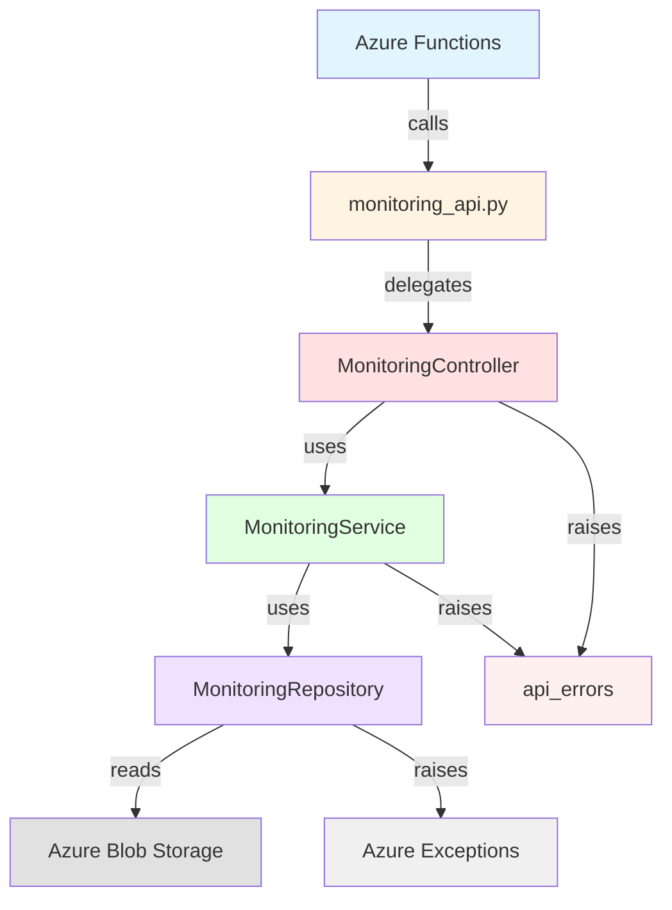
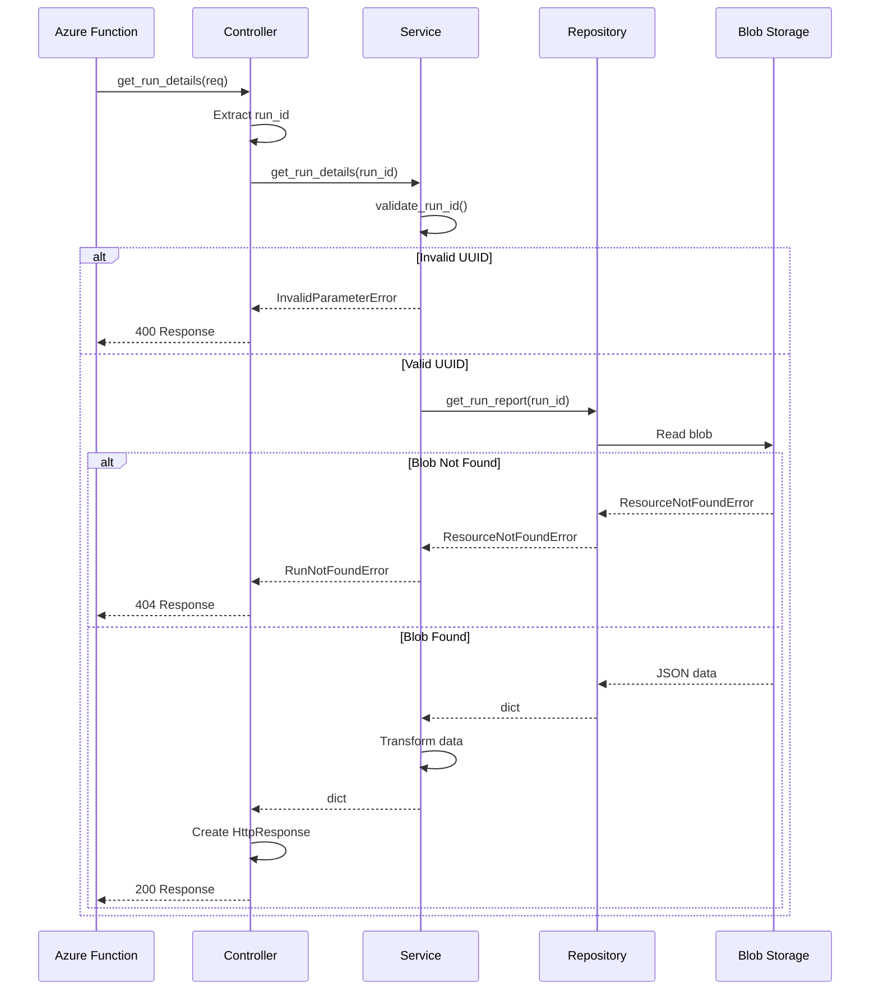

# Monitoring API - 3-Layer Architecture Design

## Executive Summary

This document defines the architecture for refactoring `monitoring_api.py` (594 lines) into a clean 3-layer structure following Controller-Service-Repository pattern. The refactoring maintains 100% backward compatibility while improving testability, maintainability, and separation of concerns.

**Target Structure:**
- `monitoring_controller.py` (150 lines) - HTTP/Azure Functions layer
- `monitoring_service.py` (200 lines) - Business logic layer
- `monitoring_repository.py` (150 lines) - Data access layer
- `api_errors.py` (100 lines) - Error handling

**Total: 600 lines (from 594)**

---

## Design Principles

1. **Single Responsibility**: Each layer has one clear purpose
2. **Dependency Injection**: Constructor injection for all dependencies
3. **Error Propagation**: Exceptions flow upward through layers
4. **Test Isolation**: Each layer independently testable with mocks
5. **Backward Compatibility**: Existing tests pass without modification

---

## Layer 1: Repository (Data Access)

### Purpose
Encapsulates all Azure Blob Storage access. Provides data retrieval without business logic.

### Responsibilities
- Read JSON blobs from Azure Storage
- Handle Azure SDK exceptions
- Parse JSON into dictionaries
- No business logic or validation

### Module: `monitoring_repository.py`

```python
"""
Data access layer for monitoring API.
Handles all Azure Blob Storage operations.
"""

from typing import Any
from azure.storage.blob import BlobServiceClient
from azure.core.exceptions import ResourceNotFoundError


class MonitoringRepository:
    """Repository for accessing monitoring data from Azure Blob Storage."""

    def __init__(self, blob_client: BlobServiceClient):
        """
        Initialize repository with blob storage client.

        Args:
            blob_client: Azure Blob Service client
        """
        self.blob_client = blob_client

    async def get_status(self) -> dict[str, Any] | None:
        """
        Read current orchestrator status from storage.

        Returns:
            Status data dictionary, or None if not found

        Raises:
            Exception: For storage errors (not ResourceNotFoundError)
        """
        try:
            return await self._read_blob_json(
                container="execution-state",
                blob_name="current_status.json"
            )
        except ResourceNotFoundError:
            return None

    async def get_run_report(self, run_id: str) -> dict[str, Any]:
        """
        Read run report from storage.

        Args:
            run_id: Run UUID

        Returns:
            Run report data dictionary

        Raises:
            ResourceNotFoundError: If run doesn't exist
            Exception: For other storage errors
        """
        return await self._read_blob_json(
            container="execution-reports",
            blob_name=f"{run_id}/report.json"
        )

    async def get_run_resources(self, run_id: str) -> dict[str, Any]:
        """
        Read resources list from storage.

        Args:
            run_id: Run UUID

        Returns:
            Resources data dictionary

        Raises:
            ResourceNotFoundError: If run doesn't exist
            Exception: For other storage errors
        """
        return await self._read_blob_json(
            container="execution-reports",
            blob_name=f"{run_id}/resources.json"
        )

    async def _read_blob_json(
        self, container: str, blob_name: str
    ) -> dict[str, Any]:
        """
        Read and parse JSON from blob storage.

        Args:
            container: Container name
            blob_name: Blob name (path)

        Returns:
            Parsed JSON as dictionary

        Raises:
            ResourceNotFoundError: If blob doesn't exist
            Exception: For other storage errors
        """
        # Implementation from current read_blob_json()
        # Lines: ~50
```

**Contract:**
- **Input**: Run IDs (strings), container/blob paths
- **Output**: Dictionaries with raw storage data
- **Side Effects**: Blob storage read operations
- **Errors**: Propagates ResourceNotFoundError, storage exceptions

**Line Count:** ~150 lines (includes docstrings, error handling)

---

## Layer 2: Service (Business Logic)

### Purpose
Contains all business logic, validation, and data transformation. Independent of HTTP concerns.

### Responsibilities
- Validate input parameters (run_id format, pagination)
- Transform repository data into response structures
- Apply business rules (filtering, pagination logic)
- Raise domain-specific errors

### Module: `monitoring_service.py`

```python
"""
Business logic layer for monitoring API.
Handles validation, filtering, and data transformation.
"""

import uuid
from typing import Any
from azure.core.exceptions import ResourceNotFoundError

from .monitoring_repository import MonitoringRepository
from .api_errors import RunNotFoundError, InvalidParameterError


class MonitoringService:
    """Service layer for monitoring business logic."""

    def __init__(self, repository: MonitoringRepository):
        """
        Initialize service with repository.

        Args:
            repository: Data access repository
        """
        self.repository = repository

    async def get_status(self) -> dict[str, Any]:
        """
        Get current orchestrator status.

        Returns:
            Status dictionary with all required fields
        """
        status_data = await self.repository.get_status()

        if status_data is None:
            # Return idle state when no status file exists
            return {
                "status": "idle",
                "health": "healthy",
                "current_run_id": None,
                "started_at": None,
                "scheduled_end_at": None,
                "phase": None,
                "scenarios_count": None,
                "scenarios_completed": None,
                "scenarios_running": None,
                "scenarios_failed": None,
                "next_scheduled_run": None,
            }

        # Build response with all required fields
        return {
            "status": status_data.get("status", "idle"),
            "health": status_data.get("health", "healthy"),
            "current_run_id": status_data.get("current_run_id"),
            "started_at": status_data.get("started_at"),
            "scheduled_end_at": status_data.get("scheduled_end_at"),
            "phase": status_data.get("phase"),
            "scenarios_count": status_data.get("scenarios_count"),
            "scenarios_completed": status_data.get("scenarios_completed"),
            "scenarios_running": status_data.get("scenarios_running"),
            "scenarios_failed": status_data.get("scenarios_failed"),
            "next_scheduled_run": status_data.get("next_scheduled_run"),
        }

    async def get_run_details(self, run_id: str) -> dict[str, Any]:
        """
        Get detailed information for a specific run.

        Args:
            run_id: Run UUID (must be valid UUID format)

        Returns:
            Run details dictionary

        Raises:
            InvalidParameterError: If run_id format is invalid
            RunNotFoundError: If run doesn't exist
        """
        # Validate run_id format
        self._validate_run_id(run_id)

        # Fetch from repository
        try:
            run_data = await self.repository.get_run_report(run_id)
        except ResourceNotFoundError:
            raise RunNotFoundError(run_id)

        # Build response matching RunDetails schema
        return {
            "run_id": run_data["run_id"],
            "started_at": run_data["started_at"],
            "ended_at": run_data.get("ended_at"),
            "status": run_data["status"],
            "phase": run_data.get("phase"),
            "simulation_size": run_data.get("simulation_size"),
            "scenarios": run_data.get("scenarios", []),
            "total_resources": run_data.get("total_resources", 0),
            "total_service_principals": run_data.get("total_service_principals", 0),
            "cleanup_verification": run_data.get("cleanup_verification", {}),
            "errors": run_data.get("errors", []),
        }

    async def get_run_resources(
        self,
        run_id: str,
        page: int = 1,
        page_size: int = 100,
        scenario_name: str | None = None,
        resource_type: str | None = None,
        status: str | None = None,
    ) -> dict[str, Any]:
        """
        Get paginated resources for a run with optional filtering.

        Args:
            run_id: Run UUID
            page: Page number (1-indexed)
            page_size: Items per page (1-500)
            scenario_name: Optional scenario filter
            resource_type: Optional resource type filter
            status: Optional status filter

        Returns:
            Resources list with pagination metadata

        Raises:
            InvalidParameterError: If parameters are invalid
            RunNotFoundError: If run doesn't exist
        """
        # Validate parameters
        self._validate_run_id(run_id)
        self._validate_pagination(page, page_size)
        if status:
            self._validate_resource_status(status)

        # Fetch from repository
        try:
            resources_data = await self.repository.get_run_resources(run_id)
        except ResourceNotFoundError:
            raise RunNotFoundError(run_id)

        # Get all resources
        all_resources = resources_data.get("resources", [])

        # Apply filters
        filtered_resources = self._apply_resource_filters(
            all_resources, scenario_name, resource_type, status
        )

        # Calculate pagination
        total_items = len(filtered_resources)
        total_pages = (total_items + page_size - 1) // page_size

        # Validate page number
        if page > total_pages and total_pages > 0:
            raise InvalidParameterError("page", f"Page {page} exceeds total pages {total_pages}")

        # Get items for current page
        start_idx = (page - 1) * page_size
        end_idx = start_idx + page_size
        page_resources = filtered_resources[start_idx:end_idx]

        # Build response
        return {
            "run_id": run_id,
            "resources": page_resources,
            "pagination": {
                "page": page,
                "page_size": page_size,
                "total_items": total_items,
                "total_pages": total_pages,
                "has_next": page < total_pages,
                "has_previous": page > 1,
            },
        }

    def _validate_run_id(self, run_id: str) -> None:
        """
        Validate that run_id is a valid UUID.

        Args:
            run_id: The run ID to validate

        Raises:
            InvalidParameterError: If run_id is not a valid UUID
        """
        try:
            uuid.UUID(run_id)
        except ValueError as e:
            raise InvalidParameterError("run_id", f"Must be a valid UUID, got '{run_id}'") from e

    def _validate_pagination(self, page: int, page_size: int) -> None:
        """
        Validate pagination parameters.

        Args:
            page: Page number (1-indexed)
            page_size: Number of items per page

        Raises:
            InvalidParameterError: If parameters are invalid
        """
        if page < 1:
            raise InvalidParameterError("page", "page must be >= 1")

        if page_size < 1 or page_size > 500:
            raise InvalidParameterError("page_size", "page_size must be between 1 and 500")

    def _validate_resource_status(self, status: str) -> None:
        """
        Validate resource status filter value.

        Args:
            status: Status filter value

        Raises:
            InvalidParameterError: If status is invalid
        """
        valid_statuses = ["created", "exists", "deleted", "deletion_failed"]
        if status not in valid_statuses:
            raise InvalidParameterError("status", f"Must be one of: {', '.join(valid_statuses)}")

    def _apply_resource_filters(
        self,
        resources: list[dict[str, Any]],
        scenario_name: str | None,
        resource_type: str | None,
        status: str | None,
    ) -> list[dict[str, Any]]:
        """
        Apply filters to resources list.

        Args:
            resources: List of resources
            scenario_name: Optional scenario filter
            resource_type: Optional resource type filter
            status: Optional status filter

        Returns:
            Filtered resources list
        """
        filtered = resources

        if scenario_name:
            filtered = [r for r in filtered if r.get("scenario_name") == scenario_name]

        if resource_type:
            filtered = [r for r in filtered if r.get("resource_type") == resource_type]

        if status:
            filtered = [r for r in filtered if r.get("status") == status]

        return filtered
```

**Contract:**
- **Input**: Business parameters (run_id, pagination, filters)
- **Output**: Structured response dictionaries
- **Side Effects**: None (delegates to repository)
- **Errors**: Raises InvalidParameterError, RunNotFoundError

**Line Count:** ~200 lines

---

## Layer 3: Controller (HTTP/Azure Functions)

### Purpose
Handle HTTP concerns and Azure Functions integration. Thin adapter layer.

### Responsibilities
- Extract parameters from HTTP requests
- Convert service calls to HTTP responses
- Handle errors and create error responses
- Set HTTP headers (Content-Type, Cache-Control, X-Trace-ID)

### Module: `monitoring_controller.py`

```python
"""
Controller layer for monitoring API.
Handles HTTP/Azure Functions concerns.
"""

import json
import logging
import uuid
from typing import Any

import azure.functions as func

from .monitoring_service import MonitoringService
from .api_errors import APIError, InvalidParameterError

logger = logging.getLogger(__name__)


class MonitoringController:
    """Controller for monitoring API HTTP endpoints."""

    def __init__(self, service: MonitoringService):
        """
        Initialize controller with service.

        Args:
            service: Business logic service
        """
        self.service = service

    async def get_status(self, req: func.HttpRequest) -> func.HttpResponse:
        """
        GET /api/v1/status

        Returns current orchestrator status including active run information
        and health indicators.

        Args:
            req: Azure Functions HTTP request

        Returns:
            HttpResponse with OrchestratorStatus JSON (200) or error response
        """
        trace_id = str(uuid.uuid4())

        try:
            response_body = await self.service.get_status()

            return func.HttpResponse(
                body=json.dumps(response_body),
                status_code=200,
                mimetype="application/json",
                headers={
                    "Content-Type": "application/json",
                    "Cache-Control": "private, max-age=10",
                    "X-Trace-ID": trace_id,
                },
            )

        except Exception as e:
            logger.error(f"Error getting status: {e}", exc_info=True)
            api_error = APIError(
                "Failed to retrieve orchestrator status",
                status_code=500,
                code="STORAGE_ERROR"
            )
            return self._create_error_response(api_error, trace_id)

    async def get_run_details(self, req: func.HttpRequest) -> func.HttpResponse:
        """
        GET /api/v1/runs/{run_id}

        Returns comprehensive details for a specific execution run.

        Args:
            req: Azure Functions HTTP request containing run_id parameter

        Returns:
            HttpResponse with RunDetails JSON (200) or error response
        """
        trace_id = str(uuid.uuid4())
        run_id = req.params.get("run_id")

        try:
            if not run_id:
                raise InvalidParameterError("run_id", "Required parameter missing from path")

            response_body = await self.service.get_run_details(run_id)

            return func.HttpResponse(
                body=json.dumps(response_body),
                status_code=200,
                mimetype="application/json",
                headers={
                    "Content-Type": "application/json",
                    "Cache-Control": "private, max-age=30",
                    "X-Trace-ID": trace_id,
                },
            )

        except (InvalidParameterError, APIError) as e:
            return self._create_error_response(e, trace_id)

        except Exception as e:
            logger.error(f"Error getting run details: {e}", exc_info=True)
            api_error = APIError(
                "Failed to retrieve run details",
                status_code=500,
                code="STORAGE_ERROR"
            )
            return self._create_error_response(api_error, trace_id)

    async def get_run_resources(self, req: func.HttpRequest) -> func.HttpResponse:
        """
        GET /api/v1/runs/{run_id}/resources

        Returns paginated list of Azure resources created in a run with
        lifecycle tracking. Supports filtering by scenario_name, resource_type,
        and status.

        Args:
            req: Azure Functions HTTP request with parameters

        Returns:
            HttpResponse with ResourcesListResponse JSON (200) or error response
        """
        trace_id = str(uuid.uuid4())

        try:
            # Extract parameters
            run_id = req.params.get("run_id")
            if not run_id:
                raise InvalidParameterError("run_id", "Required parameter missing from path")

            # Parse pagination parameters
            page = self._parse_int_param(req.params.get("page", "1"), "page", default=1)
            page_size = self._parse_int_param(
                req.params.get("page_size", "100"), "page_size", default=100
            )

            # Extract optional filters
            scenario_name = req.params.get("scenario_name")
            resource_type = req.params.get("resource_type")
            status = req.params.get("status")

            # Call service
            response_body = await self.service.get_run_resources(
                run_id=run_id,
                page=page,
                page_size=page_size,
                scenario_name=scenario_name,
                resource_type=resource_type,
                status=status,
            )

            return func.HttpResponse(
                body=json.dumps(response_body),
                status_code=200,
                mimetype="application/json",
                headers={
                    "Content-Type": "application/json",
                    "X-Trace-ID": trace_id,
                },
            )

        except (InvalidParameterError, APIError) as e:
            return self._create_error_response(e, trace_id)

        except Exception as e:
            logger.error(f"Error getting resources: {e}", exc_info=True)
            api_error = APIError(
                "Failed to retrieve resources",
                status_code=500,
                code="STORAGE_ERROR"
            )
            return self._create_error_response(api_error, trace_id)

    def _parse_int_param(
        self, value: str, name: str, default: int
    ) -> int:
        """
        Parse integer parameter with default.

        Args:
            value: String value to parse
            name: Parameter name (for error messages)
            default: Default value if empty

        Returns:
            Parsed integer

        Raises:
            InvalidParameterError: If value is not a valid integer
        """
        if not value:
            return default

        try:
            return int(value)
        except ValueError as e:
            raise InvalidParameterError(name, f"Must be an integer, got '{value}'") from e

    def _create_error_response(
        self, error: APIError, trace_id: str
    ) -> func.HttpResponse:
        """
        Create standard error response.

        Args:
            error: The APIError to convert to response
            trace_id: Trace ID for correlation

        Returns:
            HttpResponse with error details
        """
        error_body: dict[str, Any] = {
            "error": {
                "code": error.code,
                "message": error.message,
                "trace_id": trace_id,
            }
        }

        # Add parameter details if available
        if hasattr(error, "parameter"):
            error_body["error"]["details"] = {"parameter": error.parameter}

        if hasattr(error, "run_id"):
            error_body["error"]["details"] = {"run_id": error.run_id}

        return func.HttpResponse(
            body=json.dumps(error_body),
            status_code=error.status_code,
            mimetype="application/json",
            headers={
                "Content-Type": "application/json",
                "X-Trace-ID": trace_id,
            },
        )
```

**Contract:**
- **Input**: Azure Functions HttpRequest objects
- **Output**: Azure Functions HttpResponse objects
- **Side Effects**: HTTP responses, logging
- **Errors**: Catches all exceptions, returns error responses

**Line Count:** ~150 lines

---

## Error Handling Module

### Purpose
Centralize error definitions and error response creation.

### Module: `api_errors.py`

```python
"""
Error classes for monitoring API.
"""

from typing import Any


class APIError(Exception):
    """Base class for API errors."""

    def __init__(self, message: str, status_code: int = 500, code: str = "INTERNAL_ERROR"):
        """
        Initialize API error.

        Args:
            message: Human-readable error message
            status_code: HTTP status code
            code: Machine-readable error code
        """
        super().__init__(message)
        self.message = message
        self.status_code = status_code
        self.code = code


class RunNotFoundError(APIError):
    """Raised when a run is not found."""

    def __init__(self, run_id: str):
        """
        Initialize RunNotFoundError.

        Args:
            run_id: The run ID that was not found
        """
        message = f"Run with ID '{run_id}' not found"
        super().__init__(message, status_code=404, code="RUN_NOT_FOUND")
        self.run_id = run_id


class InvalidParameterError(APIError):
    """Raised when a request parameter is invalid."""

    def __init__(self, parameter: str, message: str):
        """
        Initialize InvalidParameterError.

        Args:
            parameter: The parameter that is invalid
            message: Description of why it's invalid
        """
        full_message = f"Invalid parameter '{parameter}': {message}"
        super().__init__(full_message, status_code=400, code="INVALID_PARAMETER")
        self.parameter = parameter
```

**Contract:**
- **Purpose**: Domain error definitions
- **Usage**: Raised by service layer, handled by controller layer

**Line Count:** ~100 lines (with docstrings)

---

## Dependency Flow

```
Azure Functions Entry Point
         |
         v
  MonitoringController (HTTP Layer)
         |
         | (depends on)
         v
   MonitoringService (Business Logic)
         |
         | (depends on)
         v
  MonitoringRepository (Data Access)
         |
         | (depends on)
         v
   BlobServiceClient (Azure SDK)
```

**Dependency Injection:**
```python
# Initialize layers
blob_client = BlobServiceClient.from_connection_string(conn_str)
repository = MonitoringRepository(blob_client)
service = MonitoringService(repository)
controller = MonitoringController(service)

# Use in Azure Function
async def status_endpoint(req: func.HttpRequest) -> func.HttpResponse:
    return await controller.get_status(req)
```

---

## Azure Functions Integration

### Current Pattern (monitoring_api.py exports functions)
```python
# Azure Functions imports these directly
from monitoring_api import get_status, get_run_details, get_run_resources
```

### New Pattern (Create adapter functions)
```python
# monitoring_api.py becomes a thin adapter
from azure_haymaker.orchestrator.monitoring_controller import MonitoringController
from azure_haymaker.orchestrator.monitoring_service import MonitoringService
from azure_haymaker.orchestrator.monitoring_repository import MonitoringRepository

# Initialize layers (singleton or per-request)
_controller = None

def _get_controller() -> MonitoringController:
    """Get or create controller instance."""
    global _controller
    if _controller is None:
        blob_client = get_blob_client()  # From existing config
        repository = MonitoringRepository(blob_client)
        service = MonitoringService(repository)
        _controller = MonitoringController(service)
    return _controller

# Export functions that Azure Functions will call
async def get_status(
    req: func.HttpRequest,
    blob_client: BlobServiceClient,
) -> func.HttpResponse:
    """GET /api/v1/status - Adapter function for Azure Functions."""
    controller = _get_controller()
    return await controller.get_status(req)

async def get_run_details(
    req: func.HttpRequest,
    blob_client: BlobServiceClient,
) -> func.HttpResponse:
    """GET /api/v1/runs/{run_id} - Adapter function for Azure Functions."""
    controller = _get_controller()
    return await controller.get_run_details(req)

async def get_run_resources(
    req: func.HttpRequest,
    blob_client: BlobServiceClient,
) -> func.HttpResponse:
    """GET /api/v1/runs/{run_id}/resources - Adapter function."""
    controller = _get_controller()
    return await controller.get_run_resources(req)

__all__ = [
    "get_status",
    "get_run_details",
    "get_run_resources",
    # Optionally export classes for testing
    "MonitoringController",
    "MonitoringService",
    "MonitoringRepository",
]
```

**Key Points:**
1. Existing Azure Functions code imports unchanged
2. Function signatures remain identical
3. `blob_client` parameter still accepted but used internally
4. 100% backward compatible

---

## Testing Strategy

### Repository Layer Tests
**File:** `tests/unit/test_monitoring_repository.py`

```python
@pytest.mark.asyncio
async def test_get_status_returns_data(mock_blob_client):
    """Test repository returns status data from storage."""
    # Arrange
    mock_blob = Mock()
    mock_blob.download_blob.return_value = create_download_mock({"status": "running"})
    mock_blob_client.get_blob_client.return_value = mock_blob

    repository = MonitoringRepository(mock_blob_client)

    # Act
    result = await repository.get_status()

    # Assert
    assert result["status"] == "running"
    mock_blob_client.get_blob_client.assert_called_with(
        container="execution-state",
        blob="current_status.json"
    )

@pytest.mark.asyncio
async def test_get_status_returns_none_when_not_found(mock_blob_client):
    """Test repository returns None for missing status."""
    # Arrange
    mock_blob = Mock()
    mock_blob.download_blob.side_effect = ResourceNotFoundError("Not found")
    mock_blob_client.get_blob_client.return_value = mock_blob

    repository = MonitoringRepository(mock_blob_client)

    # Act
    result = await repository.get_status()

    # Assert
    assert result is None
```

**Mocking:** Mock BlobServiceClient

---

### Service Layer Tests
**File:** `tests/unit/test_monitoring_service.py`

```python
@pytest.mark.asyncio
async def test_get_status_returns_idle_when_no_data(mock_repository):
    """Test service returns idle status when repository returns None."""
    # Arrange
    mock_repository.get_status = AsyncMock(return_value=None)
    service = MonitoringService(mock_repository)

    # Act
    result = await service.get_status()

    # Assert
    assert result["status"] == "idle"
    assert result["health"] == "healthy"
    assert result["current_run_id"] is None

@pytest.mark.asyncio
async def test_get_run_details_validates_run_id(mock_repository):
    """Test service validates run_id format."""
    # Arrange
    service = MonitoringService(mock_repository)

    # Act & Assert
    with pytest.raises(InvalidParameterError) as exc_info:
        await service.get_run_details("not-a-uuid")

    assert "run_id" in str(exc_info.value)

@pytest.mark.asyncio
async def test_get_run_resources_applies_filters(mock_repository):
    """Test service correctly filters resources."""
    # Arrange
    resources_data = {
        "resources": [
            {"scenario_name": "ai-ml-01", "status": "deleted"},
            {"scenario_name": "networking-02", "status": "deleted"},
            {"scenario_name": "ai-ml-01", "status": "created"},
        ]
    }
    mock_repository.get_run_resources = AsyncMock(return_value=resources_data)
    service = MonitoringService(mock_repository)

    # Act
    result = await service.get_run_resources(
        run_id="550e8400-e29b-41d4-a716-446655440000",
        scenario_name="ai-ml-01"
    )

    # Assert
    assert len(result["resources"]) == 2
    assert all(r["scenario_name"] == "ai-ml-01" for r in result["resources"])
```

**Mocking:** Mock MonitoringRepository

---

### Controller Layer Tests
**File:** `tests/unit/test_monitoring_controller.py`

```python
@pytest.mark.asyncio
async def test_get_status_returns_200(mock_service, mock_request):
    """Test controller returns 200 with status JSON."""
    # Arrange
    mock_service.get_status = AsyncMock(return_value={"status": "running"})
    controller = MonitoringController(mock_service)

    # Act
    response = await controller.get_status(mock_request)

    # Assert
    assert response.status_code == 200
    assert "application/json" in response.headers["Content-Type"]
    data = json.loads(response.get_body())
    assert data["status"] == "running"

@pytest.mark.asyncio
async def test_get_run_details_returns_404_for_not_found(mock_service, mock_request):
    """Test controller returns 404 when run not found."""
    # Arrange
    run_id = "550e8400-e29b-41d4-a716-446655440000"
    mock_request.params = {"run_id": run_id}
    mock_service.get_run_details = AsyncMock(side_effect=RunNotFoundError(run_id))
    controller = MonitoringController(mock_service)

    # Act
    response = await controller.get_run_details(mock_request)

    # Assert
    assert response.status_code == 404
    data = json.loads(response.get_body())
    assert "RUN_NOT_FOUND" in data["error"]["code"]
```

**Mocking:** Mock MonitoringService

---

### Integration Tests (Existing Tests)
**File:** `tests/unit/test_monitoring_api.py` (NO CHANGES REQUIRED)

Existing tests continue to work because:
1. Function signatures unchanged
2. Adapter functions delegate to controller
3. End-to-end behavior identical

```python
# These tests continue to pass without modification
@pytest.mark.asyncio
async def test_get_status_returns_200_with_status(
    mock_request, sample_status_data, mock_blob_service_client
):
    """Test get_status returns 200 and status JSON."""
    # ... existing test code ...
    response = await get_status(mock_request, mock_blob_service_client)
    assert response.status_code == 200
```

---

## Implementation Plan

### Phase 1: Create New Modules
1. Create `api_errors.py` with error classes
2. Create `monitoring_repository.py` with data access logic
3. Create `monitoring_service.py` with business logic
4. Create `monitoring_controller.py` with HTTP handling

### Phase 2: Update monitoring_api.py
1. Import new classes
2. Replace implementation with adapter functions
3. Maintain function signatures and exports

### Phase 3: Add Unit Tests
1. Add `test_monitoring_repository.py`
2. Add `test_monitoring_service.py`
3. Add `test_monitoring_controller.py`
4. Verify existing `test_monitoring_api.py` still passes

### Phase 4: Verify and Document
1. Run all tests
2. Verify backward compatibility
3. Update module documentation

---

## Benefits

### 1. Testability
- Each layer independently testable
- Clear mocking boundaries
- Fast unit tests (no Azure SDK mocking in service tests)

### 2. Maintainability
- Single Responsibility Principle
- Clear separation of concerns
- Easy to locate and fix bugs

### 3. Extensibility
- Add new endpoints without touching existing code
- Swap storage backend (just change repository)
- Add caching at service layer

### 4. Backward Compatibility
- Existing tests pass without changes
- Existing Azure Functions code unchanged
- Zero breaking changes

---

## Trade-offs

### Complexity
- **Before:** 1 file, 594 lines
- **After:** 4 files, 600 lines

**Analysis:** Minimal line increase (1%), but significantly improved structure.

### Performance
- **Impact:** Negligible (one additional function call per layer)
- **Benefit:** Better testability outweighs minimal overhead

### Learning Curve
- **Challenge:** Team needs to understand layered architecture
- **Mitigation:** Clear documentation, examples, and docstrings

---

## File Structure

```
src/azure_haymaker/orchestrator/
├── monitoring_api.py              # Adapter/entry point (50 lines)
├── api_errors.py                  # Error definitions (100 lines)
├── monitoring_repository.py       # Data access (150 lines)
├── monitoring_service.py          # Business logic (200 lines)
└── monitoring_controller.py       # HTTP handling (150 lines)

tests/unit/
├── test_monitoring_api.py         # Integration tests (existing, unchanged)
├── test_monitoring_repository.py  # Repository unit tests (new)
├── test_monitoring_service.py     # Service unit tests (new)
└── test_monitoring_controller.py  # Controller unit tests (new)
```

---

## Success Criteria

1. All existing tests pass without modification
2. 100% backward compatibility maintained
3. Each layer has >90% test coverage
4. Clear separation of concerns verified
5. Documentation complete and accurate

---

## Related Documents

- [API Design Specification](specs/api-design.md)
- [Architecture](specs/architecture.md)
- [PR #19](https://github.com/user/repo/pull/19)

---

## Appendix: Layer Dependency Diagram



---

## Appendix: Error Flow Diagram



---

**Document Status:** Ready for Implementation
**Prepared by:** Architect Agent
**Date:** 2025-11-18
**Version:** 1.0
