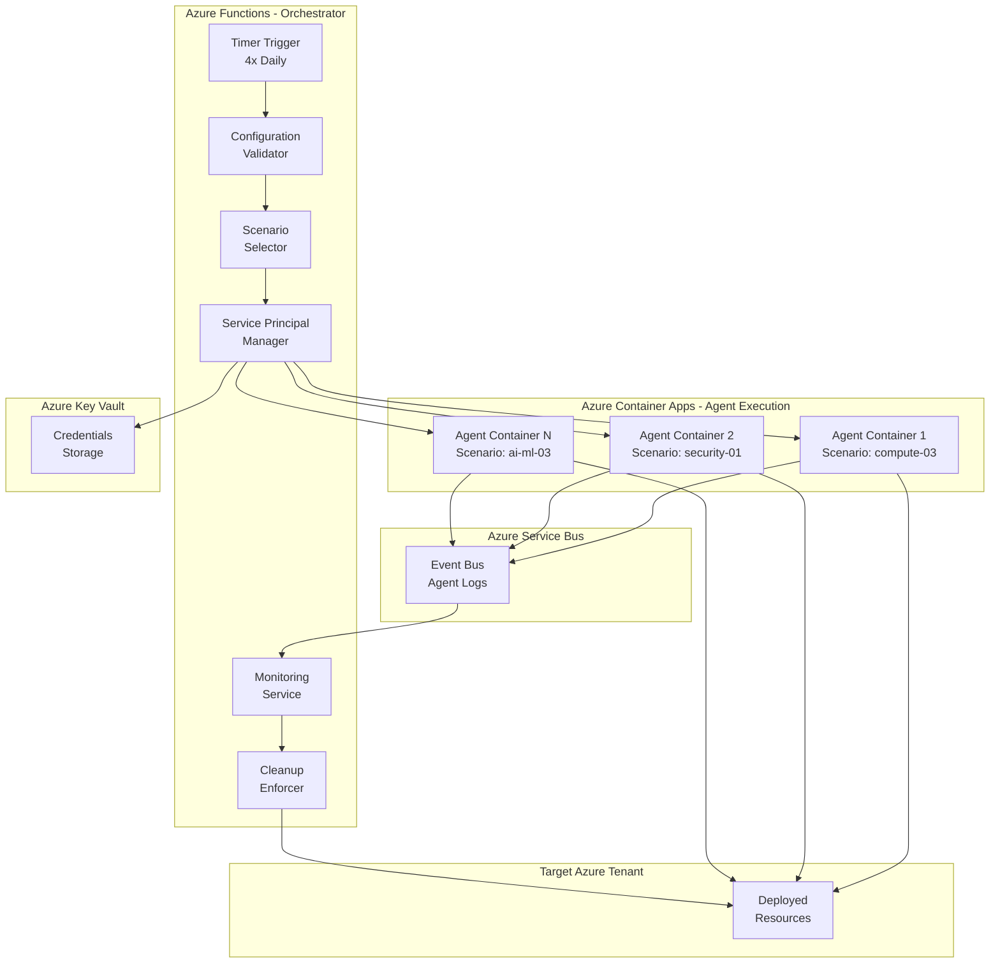
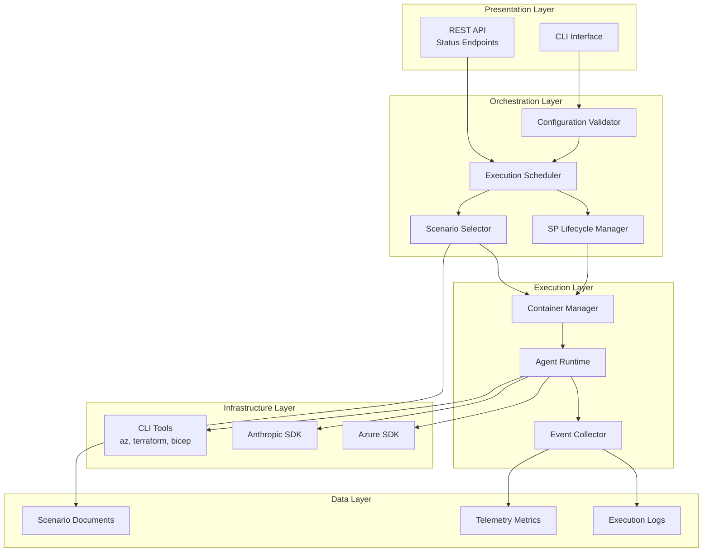
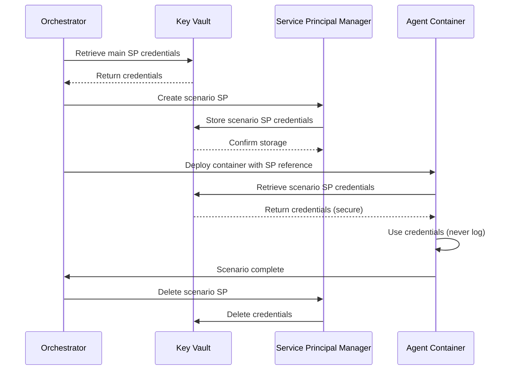
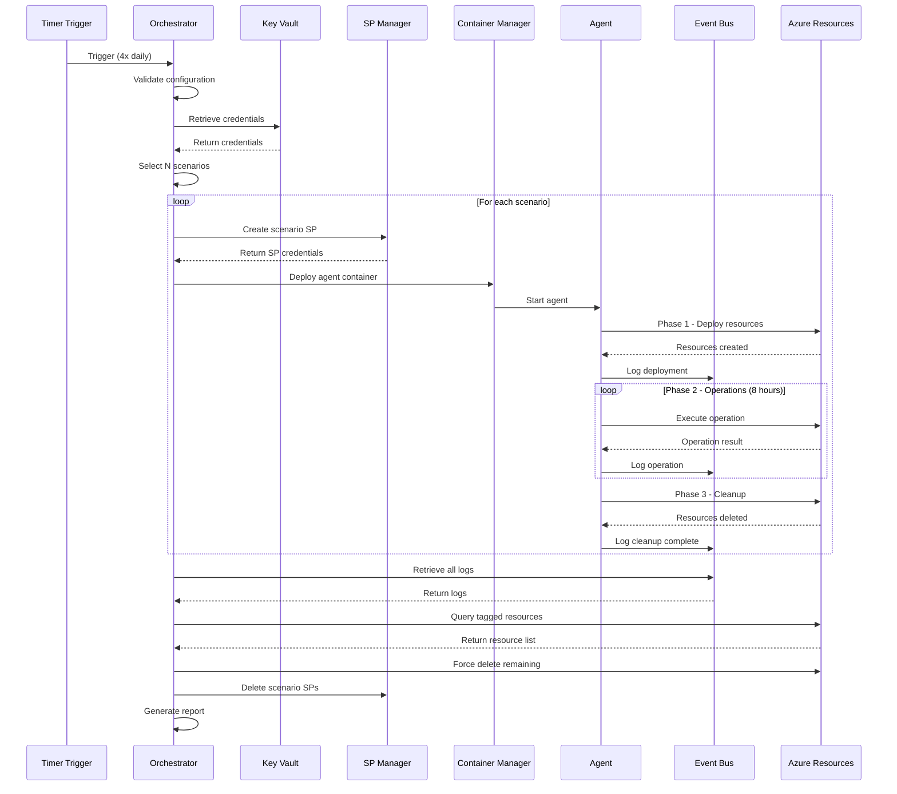
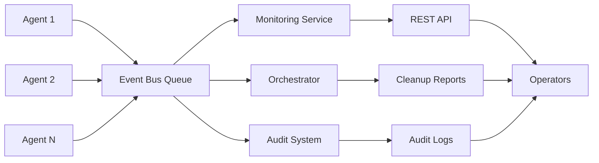

# Azure HayMaker Architecture

## Table of Contents

- [Overview](#overview)
- [System Architecture](#system-architecture)
- [Component Specifications](#component-specifications)
- [Implementation Status](#implementation-status)
- [Design Decisions](#design-decisions)
- [Security Architecture](#security-architecture)
- [Data Flow](#data-flow)
- [Deployment Model](#deployment-model)

## Overview

Azure HayMaker is an orchestration service that generates benign telemetry to simulate ordinary Azure tenant operations. The system executes multiple concurrent scenarios, each managed by an autonomous goal-seeking agent operating with dedicated credentials in isolated container environments.

### Core Principles

1. **Zero-BS Philosophy**: Every component implements real functionality with no stubs, TODOs, or placeholders
2. **Goal-Seeking Agents**: Autonomous agents resolve problems encountered during execution
3. **Complete Cleanup**: All resources are tracked, verified, and removed after execution
4. **Single Tenant Scope**: All operations constrained to one Azure tenant and subscription
5. **Observable Operations**: Comprehensive logging and monitoring at every level

### High-Level Architecture



## System Architecture

### Component Overview

Azure HayMaker is designed around five primary components:

1. **Orchestrator Service** (Azure Functions) - Schedules and coordinates scenario execution, manages service principal lifecycle, and enforces cleanup policies

2. **Agent Containers** (Azure Container Apps) - Execute individual scenarios in isolated environments and generate operational telemetry

3. **Event Bus** (Azure Service Bus) - Collects logs from all agents and provides audit trail

4. **Configuration Store** (Azure Key Vault) - Securely stores credentials and configuration

5. **Scenario Repository** (Filesystem/Git) - Currently implemented with 50+ documented scenarios, template for creating new scenarios, and reference architectures

### Architectural Layers



## Scenario Repository

**Purpose**: Storage and version control for scenario documents.

**Structure**:
```
docs/scenarios/
├── SCENARIO_TEMPLATE.md          # Template for new scenarios
├── SCALING_PLAN.md               # Roadmap for expansion
├── [area]-[num]-[name].md        # 50+ scenario documents
```

**Scenario Count by Technology Area**:
- AI & ML: 5 scenarios
- Analytics: 5 scenarios
- Compute: 5 scenarios
- Containers: 5 scenarios
- Databases: 5 scenarios
- Hybrid + Multicloud: 5 scenarios
- Identity: 5 scenarios
- Networking: 5 scenarios
- Security: 5 scenarios
- Web Apps: 5 scenarios

**Total**: 50 scenarios implemented

**Example Scenarios**:
- `compute-03-app-service-python.md` - Flask web app on App Service
- `security-01-key-vault-secrets.md` - Secret management with Key Vault
- `containers-02-aks-cluster.md` - Kubernetes cluster deployment
- `databases-02-cosmos-db.md` - NoSQL database operations
- `ai-ml-03-azure-openai.md` - OpenAI service integration

**See**: [SCENARIO_MANAGEMENT.md](SCENARIO_MANAGEMENT.md) for detailed scenario documentation.

## Design Decisions

### Decision 1: Azure Functions vs. Container Apps for Orchestrator

**Chosen**: Azure Functions (Timer Trigger)

**Rationale**:
- **Scheduling**: Built-in timer trigger for 4x daily execution
- **Cost**: Pay-per-execution model (runs 4x daily)
- **Serverless**: No infrastructure management required
- **Integration**: Native Azure SDK support
- **Simplicity**: Straightforward deployment model

**Alternatives Considered**:
- **Container Apps**: More complex for scheduling, better for long-running processes
- **Logic Apps**: Less flexible for complex Python logic
- **VM-based**: Higher cost and maintenance burden

### Decision 2: Azure Service Bus vs. Event Hubs vs. Event Grid

**Chosen**: Azure Service Bus (Queue)

**Rationale**:
- **Message Ordering**: Guaranteed FIFO for agent logs
- **Persistence**: 7-day message retention for audit
- **Reliability**: At-least-once delivery guarantee
- **Simplicity**: Straightforward queue model
- **Cost**: Reasonable for expected message volume

**Alternatives Considered**:
- **Event Hubs**: Overkill for our message volume, designed for millions of events/sec
- **Event Grid**: Better for event routing, not log aggregation
- **Storage Queues**: Less features, no topics/subscriptions

### Decision 3: Scenario Selection Algorithm - Random vs. Round-Robin

**Chosen**: Random Selection

**Rationale**:
- **Realism**: Real tenants don't execute scenarios in predictable patterns
- **Simplicity**: No state to maintain between executions
- **Coverage**: Over time, all scenarios get executed
- **Flexibility**: Easy to weight certain scenarios if needed

**Alternatives Considered**:
- **Round-Robin**: Ensures even distribution but predictable
- **Priority-Based**: More complex, requires priority assignment
- **Load-Based**: Requires resource profiling of scenarios

### Decision 4: Container Resources - 64GB RAM, 2 CPUs

**Chosen**: 64GB RAM, 2 CPUs per agent container

**Rationale**:
- **Azure CLI**: Requires ~2GB for operations
- **Terraform**: State management can be memory-intensive
- **Claude Code**: Requires substantial memory for context
- **Overhead**: OS, Python runtime, tools
- **Safety Margin**: Ensures agents don't run out of memory

**Cost Consideration**:
- 5 concurrent scenarios = 320GB RAM, 10 CPUs
- ~$200-300/month for 4 executions/day (8 hours each)
- Acceptable for realistic telemetry generation

**Alternatives Considered**:
- **32GB RAM, 1 CPU**: Risk of memory exhaustion
- **128GB RAM, 4 CPUs**: Unnecessary overhead, higher cost

### Decision 5: Service Principal Lifecycle - Ephemeral vs. Persistent

**Chosen**: Ephemeral (created per execution, deleted after)

**Rationale**:
- **Security**: Minimizes credential lifetime and exposure
- **Isolation**: Each execution gets fresh credentials
- **Cleanup**: Credentials automatically invalidated after scenario
- **Auditing**: Clear association between SP and scenario execution

**Cost**: Negligible (SP creation is free, role assignments are free)

**Alternatives Considered**:
- **Persistent SPs**: Reused across executions, easier but less secure
- **Managed Identity**: Cannot be used for service-to-service in this model

### Decision 6: Scenario Document Format - Markdown vs. YAML

**Chosen**: Markdown with embedded bash code blocks

**Rationale**:
- **Readability**: Human-readable documentation
- **Embedded**: Scenario context and commands in one file
- **Agent-Friendly**: Claude can easily parse and extract commands
- **Version Control**: Git-friendly format with clear diffs
- **Documentation**: Doubles as reference documentation

**Alternatives Considered**:
- **YAML with scripts**: Harder to read, requires separate script files
- **Python modules**: Less accessible for non-developers
- **JSON**: Not human-friendly

### Decision 7: Cleanup Strategy - Agent-Only vs. Orchestrator-Enforced

**Chosen**: Orchestrator-Enforced with Tag-Based Verification

**Rationale**:
- **Reliability**: Ensures cleanup happens even if agent fails
- **Cost Control**: Prevents resource leaks
- **Accountability**: Orchestrator validates cleanup completion
- **Safety Net**: Force-deletes anything agent misses

**Process**:
1. Agent performs cleanup (Phase 3)
2. Agent logs cleanup completion
3. Orchestrator queries Azure for tagged resources
4. Orchestrator force-deletes any remaining resources
5. Orchestrator deletes service principal

**Alternatives Considered**:
- **Agent-Only**: Risky, agent failures leave resources behind
- **Orchestrator-Only**: Agent doesn't learn, no graceful cleanup

### Decision 8: Agent Error Handling - Fail-Fast vs. Goal-Seeking

**Chosen**: Goal-Seeking with Claude Analysis

**Rationale**:
- **Resilience**: Agents attempt to resolve errors autonomously
- **Learning**: Errors and resolutions logged for analysis
- **Realism**: Real administrators troubleshoot and resolve issues
- **Telemetry**: Error resolution generates valuable telemetry

**Process**:
1. Agent encounters error
2. Agent sends error context to Claude
3. Claude analyzes error and suggests resolution
4. Agent attempts resolution
5. If resolved, continue; if not, cleanup and fail gracefully

**Alternatives Considered**:
- **Fail-Fast**: Simpler but less realistic, more manual intervention
- **Retry-Only**: Doesn't address root cause

## Security Architecture

### Threat Model

**Assumptions**:
- Azure tenant is test/dev environment (not production)
- Operators trust the orchestrator service
- Service principals have limited scope (single subscription)
- No malicious scenarios in repository

**Threats**:

1. **Credential Leakage**
   - **Risk**: Service principal secrets exposed in logs or errors
   - **Mitigation**: Credential scrubbing, secure environment variables, Key Vault storage

2. **Privilege Escalation**
   - **Risk**: Scenario SPs gain excessive permissions
   - **Mitigation**: Strict role assignment logic, time-limited SPs, audit logging

3. **Resource Leakage**
   - **Risk**: Resources not cleaned up, accumulating costs
   - **Mitigation**: Forced cleanup verification, cost alerts, tag-based queries

4. **Lateral Movement**
   - **Risk**: Compromised agent affects other resources
   - **Mitigation**: Isolated containers, scoped credentials, network policies

5. **Data Exfiltration**
   - **Risk**: Agents extract sensitive data
   - **Mitigation**: Benign-only scenarios, network egress controls, audit logs

### Security Controls

#### 1. Credential Management



**Controls**:
- Main SP credentials stored in Azure Key Vault
- Scenario SP credentials generated per execution
- Credentials passed via secure environment variables only
- Credentials never logged or written to disk
- Credentials cleared from memory after use
- Credentials automatically invalidated after scenario (SP deleted)

#### 2. Least Privilege

**Main Service Principal Roles**:
- **Contributor**: Create/delete Azure resources
- **User Access Administrator**: Assign roles to scenario SPs
- **Key Vault Administrator**: Manage credential storage

**Scenario Service Principal Roles**:
- **Contributor**: Create/delete scenario resources only
- **User Access Administrator**: Assign roles within scenario scope

**Restrictions**:
- All roles scoped to single subscription
- No Global Administrator or privileged roles
- Time-limited (12 hours max)
- Deleted immediately after scenario

#### 3. Network Security

**Container Network Policy**:
```yaml
apiVersion: networking.k8s.io/v1
kind: NetworkPolicy
metadata:
  name: agent-network-policy
spec:
  podSelector:
    matchLabels:
      app: haymaker-agent
  policyTypes:
  - Egress
  egress:
  - to:
    - podSelector: {}
    ports:
    - protocol: TCP
      port: 443  # HTTPS only
  - to:
    - namespaceSelector: {}
    ports:
    - protocol: TCP
      port: 53  # DNS
```

**Allowed Outbound**:
- Azure management APIs (management.azure.com)
- Anthropic API (api.anthropic.com)
- Azure Service Bus (for logging)
- Azure Key Vault (for credentials)

**Blocked Outbound**:
- All other internet destinations
- Internal networks (if applicable)

#### 4. Audit Logging

**Logged Events**:
- All service principal creation/deletion
- All role assignments
- All resource creation/deletion
- All API calls to Azure and Anthropic
- All errors and exceptions
- All cleanup operations

**Log Retention**:
- Event Bus messages: 7 days
- Azure Activity Log: 90 days (default)
- Container logs: 30 days

**Log Access**:
- Orchestrator: Read/write
- Monitoring service: Read-only
- Audit system: Read-only

#### 5. Resource Tagging

**Required Tags**:
```bash
AzureHayMaker-managed=true
Scenario=[scenario-id]
Owner=AzureHayMaker
ExecutionId=[unique-execution-id]
CreatedAt=[timestamp]
```

**Purpose**:
- Identify all HayMaker-created resources
- Enable cleanup verification
- Support cost tracking
- Facilitate audit queries

**Enforcement**:
- Scenarios must include tags in all creation commands
- Orchestrator verifies tags present
- Cleanup queries by tag

## Data Flow

### Execution Flow



### Logging Data Flow



## Deployment Model

### Deployment Considerations

The Azure HayMaker architecture is designed to use:
- Azure Functions for orchestration scheduling
- Azure Service Bus for logging infrastructure
- Azure Key Vault for credential management
- Azure Container Apps for isolated scenario execution
- Tag-based resource tracking for cleanup verification

---

## Summary

Azure HayMaker is designed as a robust, secure, and scalable orchestration service for generating benign Azure telemetry. The architecture prioritizes:

1. **Security First**: Ephemeral credentials, least privilege, comprehensive auditing
2. **Complete Cleanup**: Tag-based tracking and forced cleanup verification
3. **Goal-Seeking Agents**: Autonomous error resolution capabilities
4. **Observable Operations**: Comprehensive logging and monitoring at every level
5. **Single Tenant Scope**: All operations constrained to one Azure subscription

For scenario implementation details, see [SCENARIO_MANAGEMENT.md](SCENARIO_MANAGEMENT.md).
For getting started with scenarios, see [GETTING_STARTED.md](GETTING_STARTED.md).
