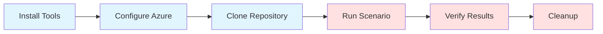
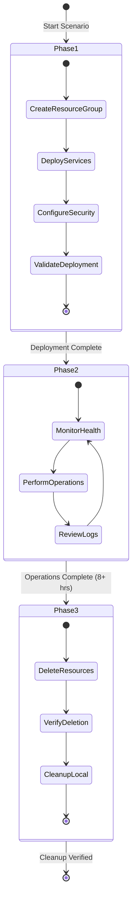

# Getting Started with Azure HayMaker

## Table of Contents

- [Quick Start (30 Minutes)](#quick-start-30-minutes)
- [Prerequisites](#prerequisites)
- [Installation](#installation)
- [Configuration](#configuration)
- [Your First Scenario](#your-first-scenario)
- [Understanding the Output](#understanding-the-output)
- [Next Steps](#next-steps)
- [Troubleshooting](#troubleshooting)

## Quick Start (30 Minutes)

This guide will get you up and running with Azure HayMaker in approximately 30 minutes. You'll:

1. Install prerequisites (10 min)
2. Configure Azure access (5 min)
3. Run your first scenario manually (10 min)
4. Understand the three-phase execution model (5 min)



### Prerequisites Checklist

Before starting, ensure you have:

- [ ] Azure subscription (free tier works)
- [ ] Azure CLI installed
- [ ] Python 3.13+ installed
- [ ] Git installed
- [ ] Text editor or IDE
- [ ] Terminal/command prompt

**Time Budget**: 10 minutes if installing from scratch

## Prerequisites

### 1. Azure Subscription

You need an Azure subscription with permissions to:
- Create resource groups
- Create resources (VMs, App Services, Storage, etc.)
- Assign roles (if testing identity scenarios)

**Get a subscription**:
- Free tier: https://azure.microsoft.com/free/
- Existing subscription: Use portal.azure.com

**Verify access**:
```bash
# This command should list your subscriptions
az account list --output table

# If not logged in, authenticate
az login

# Set your subscription
az account set --subscription "YOUR_SUBSCRIPTION_NAME_OR_ID"

# Verify current subscription
az account show --output table
```

**Expected output**:
```
Name                CloudName    SubscriptionId                        State    IsDefault
------------------  -----------  ------------------------------------  -------  -----------
My Subscription     AzureCloud   12345678-1234-1234-1234-123456789012  Enabled  True
```

### 2. Azure CLI

**Installation**:

**macOS**:
```bash
brew install azure-cli
```

**Linux (Ubuntu/Debian)**:
```bash
curl -sL https://aka.ms/InstallAzureCLIDeb | sudo bash
```

**Windows**:
```powershell
# Using winget
winget install -e --id Microsoft.AzureCLI

# Or download MSI from:
# https://aka.ms/installazurecliwindows
```

**Verify installation**:
```bash
az --version
```

**Expected output**:
```
azure-cli                         2.54.0

core                              2.54.0
telemetry                          1.1.0

Dependencies:
msal                              1.24.1
azure-mgmt-resource               23.1.0

Python location '/usr/local/bin/python3'
Extensions directory '/Users/user/.azure/cliextensions'

Python (Darwin) 3.11.6 (main, Oct  2 2023, 13:45:54) [Clang 15.0.0]
```

### 3. Python 3.13+

**Check current version**:
```bash
python --version
# or
python3 --version
```

**Installation**:

**macOS (using Homebrew)**:
```bash
brew install python@3.13
```

**Linux (Ubuntu/Debian)**:
```bash
sudo apt update
sudo apt install python3.13 python3.13-venv python3-pip
```

**Windows**:
Download from https://www.python.org/downloads/

**Verify installation**:
```bash
python3 --version
# Should show: Python 3.13.x
```

### 4. Git

**Check if installed**:
```bash
git --version
```

**Installation**:

**macOS**:
```bash
brew install git
```

**Linux (Ubuntu/Debian)**:
```bash
sudo apt install git
```

**Windows**:
Download from https://git-scm.com/download/win


## Installation

### Step 1: Clone the Repository

```bash
# Clone from GitHub
git clone https://github.com/rysweet/AzureHayMaker.git

# Navigate into directory
cd AzureHayMaker

# Verify you're in the right place
ls -la docs/scenarios/
```

**Expected output**:
```
total 1024
drwxr-xr-x  54 user  staff   1728 Nov 15 10:00 .
drwxr-xr-x   4 user  staff    128 Nov 15 10:00 ..
-rw-r--r--   1 user  staff   8426 Nov 15 10:00 SCALING_PLAN.md
-rw-r--r--   1 user  staff   2847 Nov 15 10:00 SCENARIO_TEMPLATE.md
-rw-r--r--   1 user  staff  14523 Nov 15 10:00 compute-01-linux-vm-web-server.md
-rw-r--r--   1 user  staff  12847 Nov 15 10:00 compute-03-app-service-python.md
...
```

### Step 2: Verify Prerequisites

Run this verification script:

```bash
# Create verification script
cat > verify_prereqs.sh << 'EOF'
#!/bin/bash
echo "=== Azure HayMaker Prerequisites Check ==="
echo ""

# Check Azure CLI
if command -v az &> /dev/null; then
    echo "✓ Azure CLI installed: $(az --version | head -n1)"
else
    echo "✗ Azure CLI not found"
fi

# Check Python
if command -v python3 &> /dev/null; then
    PYTHON_VERSION=$(python3 --version | cut -d' ' -f2)
    echo "✓ Python installed: $PYTHON_VERSION"
    if [[ "$PYTHON_VERSION" > "3.13" ]]; then
        echo "  ✓ Version 3.13+ satisfied"
    else
        echo "  ✗ Version 3.13+ required, found $PYTHON_VERSION"
    fi
else
    echo "✗ Python not found"
fi

# Check Git
if command -v git &> /dev/null; then
    echo "✓ Git installed: $(git --version)"
else
    echo "✗ Git not found"
fi

# Check Azure login
if az account show &> /dev/null; then
    SUBSCRIPTION=$(az account show --query name -o tsv)
    echo "✓ Azure authenticated: $SUBSCRIPTION"
else
    echo "✗ Not logged into Azure (run: az login)"
fi

echo ""
echo "=== Verification Complete ==="
EOF

chmod +x verify_prereqs.sh
./verify_prereqs.sh
```

**Expected output**:
```
=== Azure HayMaker Prerequisites Check ===

✓ Azure CLI installed: azure-cli 2.54.0
✓ Python installed: 3.13.0
  ✓ Version 3.13+ satisfied
✓ Git installed: git version 2.39.2
✓ Azure authenticated: My Azure Subscription

=== Verification Complete ===
```

## Configuration

### Azure Authentication

Ensure you're logged in and using the correct subscription:

```bash
# Login to Azure (opens browser)
az login

# List available subscriptions
az account list --output table

# Set active subscription (replace with your subscription name/ID)
az account set --subscription "YOUR_SUBSCRIPTION_NAME"

# Verify current context
az account show --query "{Name:name, ID:id, TenantId:tenantId}" --output table
```


## Your First Scenario

Let's run a simple scenario manually to understand how Azure HayMaker works.

### Choose a Scenario

We'll use `security-01-key-vault-secrets.md` as it's straightforward and demonstrates core concepts:

```bash
# View the scenario
cat docs/scenarios/security-01-key-vault-secrets.md | less
```

### Understand the Three Phases



### Phase 1: Deployment (10 minutes)

Open the scenario file and copy the Phase 1 commands:

```bash
# Open scenario in your editor
code docs/scenarios/security-01-key-vault-secrets.md
# or
vim docs/scenarios/security-01-key-vault-secrets.md
# or
cat docs/scenarios/security-01-key-vault-secrets.md
```

**Execute Phase 1 commands** (copy these from the scenario file):

```bash
# Set variables
UNIQUE_ID=$(date +%Y%m%d%H%M%S)
RESOURCE_GROUP="azurehaymaker-security-${UNIQUE_ID}-rg"
LOCATION="eastus"
KEY_VAULT_NAME="azurehaymaker-kv-${UNIQUE_ID}"
APP_SERVICE_PLAN="azurehaymaker-asp-${UNIQUE_ID}"
WEB_APP_NAME="azurehaymaker-app-${UNIQUE_ID}"

# Tags (REQUIRED - enables cleanup tracking)
TAGS="AzureHayMaker-managed=true Scenario=security-key-vault Owner=AzureHayMaker"

echo "=== Starting Phase 1: Deployment ==="
echo "Resource Group: ${RESOURCE_GROUP}"
echo "Key Vault: ${KEY_VAULT_NAME}"
echo ""

# Step 1: Create Resource Group
echo "Creating resource group..."
az group create \
  --name "${RESOURCE_GROUP}" \
  --location "${LOCATION}" \
  --tags ${TAGS}

# Step 2: Create Azure Key Vault
echo "Creating Key Vault..."
az keyvault create \
  --resource-group "${RESOURCE_GROUP}" \
  --name "${KEY_VAULT_NAME}" \
  --location "${LOCATION}" \
  --enable-rbac-authorization \
  --tags ${TAGS}

# Step 3: Set access policy for current user
echo "Setting access policy..."
CURRENT_USER_OID=$(az ad signed-in-user show --query id -o tsv)
az keyvault set-policy \
  --name "${KEY_VAULT_NAME}" \
  --object-id "${CURRENT_USER_OID}" \
  --secret-permissions get list set delete

# Step 4: Create secrets
echo "Creating secrets..."
az keyvault secret set \
  --vault-name "${KEY_VAULT_NAME}" \
  --name "api-key" \
  --value "sk-$(openssl rand -hex 32)"

az keyvault secret set \
  --vault-name "${KEY_VAULT_NAME}" \
  --name "db-connection-string" \
  --value "Server=myserver.database.windows.net;Database=mydb;User Id=sa;Password=HayMaker$(openssl rand -hex 8)"

# Validation
echo ""
echo "=== Phase 1 Validation ==="
echo "Verifying resource group..."
az group show --name "${RESOURCE_GROUP}" --query "name" -o tsv

echo "Verifying Key Vault..."
az keyvault show --name "${KEY_VAULT_NAME}" --query "name" -o tsv

echo "Listing secrets..."
az keyvault secret list --vault-name "${KEY_VAULT_NAME}" --output table

echo ""
echo "✓ Phase 1 Complete"
```

**Expected output**:
```
=== Starting Phase 1: Deployment ===
Resource Group: azurehaymaker-security-20251115123456-rg
Key Vault: azurehaymaker-kv-20251115123456

Creating resource group...
{
  "id": "/subscriptions/.../resourceGroups/azurehaymaker-security-20251115123456-rg",
  "location": "eastus",
  "name": "azurehaymaker-security-20251115123456-rg",
  ...
}

Creating Key Vault...
{
  "name": "azurehaymaker-kv-20251115123456",
  "properties": {
    "vaultUri": "https://azurehaymaker-kv-20251115123456.vault.azure.net/",
    ...
  }
}

...

=== Phase 1 Validation ===
Verifying resource group...
azurehaymaker-security-20251115123456-rg
Verifying Key Vault...
azurehaymaker-kv-20251115123456
Listing secrets...
Name                      Enabled
------------------------  ---------
api-key                   True
db-connection-string      True

✓ Phase 1 Complete
```

### Phase 2: Operations (5 minutes demo)

In production, Phase 2 runs for 8+ hours. For this demo, we'll run a few operations:

```bash
echo "=== Starting Phase 2: Operations ==="

# Operation 1: Rotate secret (create new version)
echo "Operation 1: Rotating api-key secret..."
az keyvault secret set \
  --vault-name "${KEY_VAULT_NAME}" \
  --name "api-key" \
  --value "sk-$(openssl rand -hex 32)"

# Operation 2: List secret versions
echo "Operation 2: Listing secret versions..."
az keyvault secret list-versions \
  --vault-name "${KEY_VAULT_NAME}" \
  --name "api-key" \
  --output table

# Operation 3: Check audit logs
echo "Operation 3: Checking audit logs..."
az monitor activity-log list \
  --resource-group "${RESOURCE_GROUP}" \
  --caller-only \
  --max-events 5 \
  --output table

# Operation 4: Backup a secret
echo "Operation 4: Backing up secret..."
BACKUP_DIR="/tmp/kv-backup-${UNIQUE_ID}"
mkdir -p "${BACKUP_DIR}"
az keyvault secret backup \
  --vault-name "${KEY_VAULT_NAME}" \
  --name "api-key" \
  --file "${BACKUP_DIR}/api-key.backup"

echo "✓ Operations demonstrated (in production, runs 8+ hours)"
```

**Expected output**:
```
=== Starting Phase 2: Operations ===
Operation 1: Rotating api-key secret...
{
  "attributes": {
    "enabled": true,
    ...
  },
  "id": "https://azurehaymaker-kv-20251115123456.vault.azure.net/secrets/api-key/...",
  "name": "api-key"
}

Operation 2: Listing secret versions...
Id                                                    Version                           Enabled
---------------------------------------------------- --------------------------------- ---------
https://.../secrets/api-key/abc123...                abc123...                          True
https://.../secrets/api-key/def456...                def456...                          True

Operation 3: Checking audit logs...
EventTimestamp          Caller               OperationName                     Status
----------------------  -------------------  --------------------------------  --------
2025-11-15T12:35:00Z    user@example.com     Microsoft.KeyVault/vaults/write   Succeeded
...

Operation 4: Backing up secret...
Backup saved to: /tmp/kv-backup-20251115123456/api-key.backup

✓ Operations demonstrated (in production, runs 8+ hours)
```

### Phase 3: Cleanup (2 minutes)

**IMPORTANT**: Always run cleanup to avoid ongoing charges!

```bash
echo "=== Starting Phase 3: Cleanup ==="

# Step 1: Delete resource group (deletes all contained resources)
echo "Deleting resource group (this includes Key Vault and all secrets)..."
az group delete \
  --name "${RESOURCE_GROUP}" \
  --yes \
  --no-wait

# Step 2: Wait for deletion to complete
echo "Waiting for deletion to complete..."
sleep 30
echo "Checking deletion status..."

# Step 3: Verify deletion
if az group exists --name "${RESOURCE_GROUP}" | grep -q "false"; then
  echo "✓ Resource group successfully deleted"
else
  echo "⏳ Resource group still deleting (this is normal, check portal)"
fi

# Step 4: Clean up local files
echo "Cleaning up local backup files..."
rm -rf "${BACKUP_DIR}"

echo ""
echo "✓ Phase 3 Complete"
echo ""
echo "=== Scenario Execution Complete ==="
```

**Expected output**:
```
=== Starting Phase 3: Cleanup ===
Deleting resource group (this includes Key Vault and all secrets)...
Waiting for deletion to complete...
Checking deletion status...
✓ Resource group successfully deleted
Cleaning up local backup files...

✓ Phase 3 Complete

=== Scenario Execution Complete ===
```

### Verify Complete Cleanup

Double-check no resources remain:

```bash
# Check for any resources with HayMaker tag
echo "Checking for any remaining HayMaker resources..."
REMAINING=$(az resource list --tag AzureHayMaker-managed=true --output table)

if [ -z "$REMAINING" ]; then
  echo "✓ No HayMaker resources found - cleanup successful"
else
  echo "⚠ Found remaining resources:"
  echo "$REMAINING"
  echo ""
  echo "Delete them with:"
  echo "az resource delete --ids <resource-id>"
fi
```

**Expected output**:
```
Checking for any remaining HayMaker resources...
✓ No HayMaker resources found - cleanup successful
```

## Understanding the Output

### What Just Happened?

You just executed a complete Azure HayMaker scenario manually:

1. **Phase 1 - Deployment (10 min)**:
   - Created resource group with proper tags
   - Deployed Azure Key Vault
   - Created multiple secrets
   - Configured access policies
   - Validated all resources created

2. **Phase 2 - Operations (5 min demo, 8+ hrs in production)**:
   - Rotated secrets (created new versions)
   - Reviewed audit logs
   - Backed up secrets
   - Demonstrated realistic management operations

3. **Phase 3 - Cleanup (2 min)**:
   - Deleted all Azure resources
   - Removed local artifacts
   - Verified complete cleanup

### Key Concepts Demonstrated

#### 1. Resource Tagging
```bash
TAGS="AzureHayMaker-managed=true Scenario=security-key-vault Owner=AzureHayMaker"
```

Tags enable:
- Tracking all HayMaker-created resources
- Automated cleanup verification
- Cost analysis
- Audit queries

#### 2. Unique Naming
```bash
UNIQUE_ID=$(date +%Y%m%d%H%M%S)
RESOURCE_GROUP="azurehaymaker-security-${UNIQUE_ID}-rg"
```

Ensures:
- No name conflicts between runs
- Multiple concurrent executions possible
- Clear traceability

#### 3. Complete Cleanup
```bash
az group delete --name "${RESOURCE_GROUP}" --yes --no-wait
az group exists --name "${RESOURCE_GROUP}"
```

Guarantees:
- No resource leaks
- No unexpected costs
- Clean environment for next run

### Telemetry Generated

During this scenario, you generated operational telemetry:

**Azure Activity Log Events**:
- Resource group creation
- Key Vault creation
- Secret creation/updates
- Access policy changes
- Resource deletions

**Key Vault Audit Events**:
- Secret write operations
- Secret read operations
- Backup operations
- Access policy modifications

**Resource Metrics**:
- Key Vault request counts
- Secret operation latencies
- Authentication attempts

This is exactly the kind of benign telemetry Azure HayMaker generates at scale!

## Next Steps

### 1. Explore More Scenarios

Try different scenarios to see various Azure services:

**Simple scenarios** (15-20 min):
- `webapps-01-static-website.md` - Static website hosting
- `databases-04-redis-cache.md` - Redis cache deployment
- `identity-01-service-principals.md` - Identity management

**Intermediate scenarios** (20-30 min):
- `compute-03-app-service-python.md` - Full web app deployment
- `containers-01-simple-web-app.md` - Container deployment
- `networking-01-virtual-network.md` - Network infrastructure

**Complex scenarios** (30-45 min):
- `containers-02-aks-cluster.md` - Kubernetes cluster
- `analytics-01-batch-etl-pipeline.md` - Data pipeline
- `ai-ml-03-azure-openai.md` - AI service integration

### 2. Create Your Own Scenario

Follow the comprehensive guide in [SCENARIO_MANAGEMENT.md](SCENARIO_MANAGEMENT.md):

```bash
# Copy the template
cp docs/scenarios/SCENARIO_TEMPLATE.md \
   docs/scenarios/custom-01-my-scenario.md

# Edit with your scenario details
code docs/scenarios/custom-01-my-scenario.md

# Test your scenario
bash test-scenario.sh docs/scenarios/custom-01-my-scenario.md
```

### 3. Understand the Architecture

Read [ARCHITECTURE.md](ARCHITECTURE.md) to understand:
- How the orchestrator coordinates scenarios
- How agents execute autonomously
- How cleanup is enforced
- How credentials are managed securely


## Troubleshooting

### Issue: Azure CLI Not Authenticated

**Symptom**:
```
ERROR: Please run 'az login' to setup account.
```

**Solution**:
```bash
az login
az account set --subscription "YOUR_SUBSCRIPTION"
az account show
```

### Issue: Insufficient Permissions

**Symptom**:
```
ERROR: The client '...' does not have authorization to perform action 'Microsoft.Resources/...'
```

**Solution**:
Ensure your account has Contributor role on the subscription:

```bash
# Check current role assignments
az role assignment list \
  --assignee $(az account show --query user.name -o tsv) \
  --output table

# If you don't have Contributor, ask subscription admin to assign:
# az role assignment create \
#   --assignee <your-user-id> \
#   --role Contributor \
#   --scope /subscriptions/<subscription-id>
```

### Issue: Resource Name Already Exists

**Symptom**:
```
ERROR: The resource name 'azurehaymaker-kv-123' is already taken
```

**Solution**:
Ensure you're using unique IDs:

```bash
# Verify UNIQUE_ID generation
UNIQUE_ID=$(date +%Y%m%d%H%M%S)
echo $UNIQUE_ID

# If still conflicts, add random suffix
UNIQUE_ID="$(date +%Y%m%d%H%M%S)-$(openssl rand -hex 4)"
echo $UNIQUE_ID
```

### Issue: Key Vault Soft Delete

**Symptom**:
```
ERROR: Vault with name 'azurehaymaker-kv-123' is in soft-deleted state
```

**Solution**:
Purge the soft-deleted vault:

```bash
# List soft-deleted vaults
az keyvault list-deleted --output table

# Purge specific vault
az keyvault purge --name "azurehaymaker-kv-123" --location "eastus"

# Wait 30 seconds, then retry deployment
sleep 30
```

### Issue: Quota Exceeded

**Symptom**:
```
ERROR: Operation results in exceeding quota limits of Core
```

**Solution**:
Check and request quota increase:

```bash
# Check current quota usage
az vm list-usage --location eastus --output table

# Request quota increase via Azure portal:
# Portal → Subscriptions → Usage + quotas → Request increase
```

### Issue: Cleanup Incomplete

**Symptom**:
Resources still exist after cleanup

**Solution**:
Force delete remaining resources:

```bash
# Find all HayMaker resources
az resource list --tag AzureHayMaker-managed=true --output table

# Delete each resource
for RESOURCE_ID in $(az resource list --tag AzureHayMaker-managed=true --query "[].id" -o tsv); do
  echo "Deleting: $RESOURCE_ID"
  az resource delete --ids "$RESOURCE_ID" --verbose
done

# Verify cleanup
az resource list --tag AzureHayMaker-managed=true --output table
```

### Issue: Scenario Commands Fail

**Symptom**:
Commands in scenario don't execute as expected

**Solution**:
1. Verify all variables are set:
   ```bash
   echo "RESOURCE_GROUP: ${RESOURCE_GROUP}"
   echo "LOCATION: ${LOCATION}"
   echo "UNIQUE_ID: ${UNIQUE_ID}"
   ```

2. Check Azure CLI is up to date:
   ```bash
   az upgrade
   ```

3. Verify subscription is set:
   ```bash
   az account show --query "{Name:name, State:state}" -o table
   ```

4. Check scenario syntax:
   ```bash
   # Extract just the bash commands
   sed -n '/```bash/,/```/p' docs/scenarios/your-scenario.md > /tmp/commands.sh
   bash -n /tmp/commands.sh  # Syntax check
   ```

### Issue: Commands Too Slow

**Symptom**:
Commands take very long to complete

**Solution**:
1. Check Azure service health:
   ```bash
   az status show
   ```

2. Try different region:
   ```bash
   LOCATION="westus2"  # or westeurope, southeastasia
   ```

3. Use `--no-wait` for long operations:
   ```bash
   az group delete --name $RESOURCE_GROUP --yes --no-wait
   ```

### Getting Help

**Documentation**:
- [SCENARIO_MANAGEMENT.md](SCENARIO_MANAGEMENT.md) - Scenario creation guide
- [ARCHITECTURE.md](ARCHITECTURE.md) - System architecture
- [Azure CLI Documentation](https://learn.microsoft.com/en-us/cli/azure/)

**GitHub**:
- Report issues: https://github.com/rysweet/AzureHayMaker/issues
- Submit PRs: https://github.com/rysweet/AzureHayMaker/pulls

**Azure Support**:
- Azure documentation: https://learn.microsoft.com/azure/
- Azure support: https://azure.microsoft.com/support/

---

## Summary

You've successfully:

✅ Installed and verified all prerequisites
✅ Configured Azure CLI authentication
✅ Executed a complete Azure HayMaker scenario
✅ Understood the three-phase execution model
✅ Generated realistic operational telemetry
✅ Performed complete resource cleanup

**Next**: Explore more scenarios in `docs/scenarios/` or create your own using [SCENARIO_MANAGEMENT.md](SCENARIO_MANAGEMENT.md)!

**Remember**: Always run Phase 3 cleanup to avoid unexpected Azure charges!
