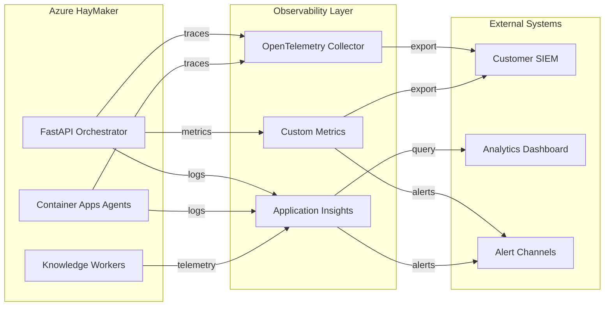

# Monitoring Strategy for Azure HayMaker

**Purpose**: Define monitoring, alerting, and observability strategy for production deployments.

**Status**: Current state + future enhancements from roadmap

**Last Updated**: 2025-11-30

---

## Current State

### ✅ Implemented Monitoring

**Application Insights** (Basic):
- Request/response logging for orchestrator API
- Exception tracking
- Custom events for execution lifecycle
- Dependency tracking (Azure SDK calls)

**Azure Monitor** (Resource-Level):
- Container Apps metrics (CPU, memory, restart count)
- App Service metrics (requests, response time, errors)
- Key Vault access logs
- Cost Management data (24-hour delay)

**Custom Metrics** (Orchestrator):
- Execution counts (total, running, completed, failed)
- Success rates per scenario
- Average execution duration
- Scenario statistics

---

## Gaps & Roadmap Enhancements

### 🔴 P0-Critical Gaps

**1. SIEM Export** (Issue #124)
- **Gap**: Telemetry stays within HayMaker, doesn't reach customer SIEM
- **Impact**: Core use case blocked
- **Timeline**: Q1 2026 (2.5-3.5 weeks)

**Monitoring Impact**:
- Export metrics (events/sec, lag, errors)
- Connector health (Sentinel, Splunk, Syslog)
- Delivery SLA (99.9% target)

---

### 🟡 P1-High Gaps

**2. Distributed Tracing** (Issue #127)
- **Gap**: No correlation between orchestrator → agent → Azure API calls
- **Impact**: Difficult to debug failures
- **Timeline**: Q2 2026 (2 weeks)

**Monitoring Impact**:
- End-to-end request tracing
- Span duration by operation type
- Dependency latency breakdown
- Error attribution (which service failed)

**3. Agent Health Checks** (Issue #129)
- **Gap**: No proactive agent health monitoring
- **Impact**: Stuck agents waste resources
- **Timeline**: Q2 2026 (2 weeks)

**Monitoring Impact**:
- Agent health status (healthy, degraded, failed)
- Circuit breaker states (open, half-open, closed)
- Failure rates per scenario
- Quarantine metrics

**4. Cost Budget Enforcement** (Issue #128)
- **Gap**: Reactive cost tracking only (no alerts or throttling)
- **Impact**: Risk of budget overruns
- **Timeline**: Q2 2026 (1.5 weeks)

**Monitoring Impact**:
- Real-time cost estimates
- Budget utilization percentage
- Throttling events
- Cost forecasts

---

## Monitoring Architecture (Future State)



---

## Key Metrics by Enhancement

### #124: SIEM Telemetry Export (P0)

**Metrics to Add**:
```kusto
// Export throughput
customMetrics
| where name == "siem_export_events_per_second"
| summarize avg(value), max(value) by bin(timestamp, 5m)

// Export latency
customMetrics
| where name == "siem_export_latency_ms"
| summarize percentiles(value, 50, 95, 99) by bin(timestamp, 5m)

// Export errors
customMetrics
| where name == "siem_export_errors"
| summarize count() by tostring(customDimensions.connector_type), tostring(customDimensions.error_type)

// Dead letter queue depth
customMetrics
| where name == "siem_export_dlq_depth"
| summarize max(value) by bin(timestamp, 1h)
```

**Alerts**:
- Export lag >5 seconds (warning)
- Export lag >30 seconds (critical)
- DLQ depth >1000 events (warning)
- Connector failures >10% (critical)

---

### #125: Windows VM Security (P0)

**Metrics to Add**:
```kusto
// JIT access requests
AzureActivity
| where OperationName == "Microsoft.Security/jitNetworkAccessPolicies/initiate/action"
| summarize count() by bin(TimeGenerated, 1h)

// Public IP assignments (should be 0 after fix)
AzureActivity
| where ResourceProvider == "Microsoft.Network" and ResourceType == "publicIPAddresses"
| where OperationName == "Create or Update Public Ip Address"
| summarize count() by bin(TimeGenerated, 1d)

// Key Vault secret access
AzureDiagnostics
| where ResourceProvider == "MICROSOFT.KEYVAULT"
| where OperationName == "SecretGet"
| where id_s contains "vm-"
| summarize count() by bin(TimeGenerated, 1h)
```

**Alerts**:
- Public IP created (critical - should never happen post-fix)
- Key Vault access from non-approved IP (critical)
- JIT access request from unknown principal (warning)

---

### #127: Distributed Tracing (P1)

**Metrics to Add**:
```kusto
// Request duration by operation
dependencies
| where type == "HTTP"
| summarize percentiles(duration, 50, 95, 99) by name

// Trace completion rate
traces
| extend TraceId = tostring(customDimensions.trace_id)
| summarize span_count = count() by TraceId
| where span_count < 5  // Expected spans per request
| summarize incomplete_traces = count()

// Service dependencies
dependencies
| summarize count() by target, type
| order by count_ desc
```

**Alerts**:
- Request duration p95 >10s (warning)
- Request duration p99 >30s (critical)
- Incomplete traces >5% (warning)

---

### #128: Cost Budget Enforcement (P1)

**Metrics to Add**:
```kusto
// Budget utilization
customMetrics
| where name == "budget_utilization_percent"
| summarize avg(value), max(value) by bin(timestamp, 1h)

// Throttling events
customEvents
| where name == "scenario_throttled"
| summarize count() by tostring(customDimensions.reason), bin(timestamp, 1h)

// Cost forecast accuracy
customMetrics
| where name == "cost_forecast_error_percent"
| summarize avg(value) by bin(timestamp, 1d)
```

**Alerts**:
- Budget utilization >80% (warning)
- Budget utilization >95% (critical)
- Throttling events detected (informational)
- Cost forecast error >20% (warning - model needs tuning)

---

### #129: Agent Health Checks (P1)

**Metrics to Add**:
```kusto
// Agent health status
customMetrics
| where name == "agent_health_score"
| summarize avg(value) by tostring(customDimensions.scenario), bin(timestamp, 5m)

// Circuit breaker state changes
customEvents
| where name == "circuit_breaker_state_change"
| summarize count() by tostring(customDimensions.scenario), tostring(customDimensions.new_state)

// Scenario quarantine events
customEvents
| where name == "scenario_quarantined"
| summarize count() by tostring(customDimensions.scenario), tostring(customDimensions.reason)

// Agent restart count
customMetrics
| where name == "agent_restarts"
| summarize sum(value) by tostring(customDimensions.scenario), bin(timestamp, 1h)
```

**Alerts**:
- Agent health score <0.5 for 15 min (warning)
- Circuit breaker open for >1 hour (critical)
- Scenario quarantined (critical - manual review required)
- Agent restart >3 times in 1 hour (warning)

---

## Alert Channels

### Current
- ✅ Webhook notifications (execution events)
- ✅ Email alerts (Azure Monitor)

### Future (with enhancements)
- Slack/Teams integration (via webhooks)
- PagerDuty for critical alerts
- SMS for on-call escalation
- Dashboard visual alerts

---

## Monitoring Dashboards

### Current: Basic Analytics API

Available via REST:
```bash
GET /api/metrics
GET /api/analytics?period=30d
GET /api/executions/{id}
```

### Future: Real-Time Dashboard (Issue #132)

**Components**:
- Execution timeline (live updates via WebSocket)
- Cost breakdown by scenario/tenant
- Agent status heatmap
- Telemetry volume over time
- SLA uptime metrics

**Technology**: React + Chart.js + WebSockets

---

## Service Level Objectives (SLOs)

### Target SLOs (Post-Enhancement)

| Metric | Target | Current | Gap |
|--------|--------|---------|-----|
| **Orchestrator Uptime** | 99.9% | ~99% | Issue #129 (circuit breakers) |
| **Agent Success Rate** | 95% | ~90% | Issue #129 (health checks) |
| **SIEM Export Delivery** | 99.9% | N/A | Issue #124 (not implemented) |
| **API Response Time (p95)** | <1s | ~2s | Issue #127 (tracing needed) |
| **Cost Variance** | <10% | ~20% | Issue #128 (budget enforcement) |
| **MTTR (Mean Time to Repair)** | <30min | ~4hrs | Issue #127 (tracing) |

---

## Monitoring Runbook

### Daily Checks
```bash
# 1. Check orchestrator health
curl https://haymaker-fastapi-app.azurewebsites.net/

# 2. Review execution metrics
curl https://haymaker-fastapi-app.azurewebsites.net/api/metrics | jq

# 3. Check for failed executions
gh api repos/rysweet/AzureHayMaker/issues?labels=bug,production
```

### Weekly Reviews
- Review analytics dashboard
- Check cost trends
- Review scenario success rates
- Identify quarantined scenarios

### Monthly Reviews
- Review SLO compliance
- Analyze cost optimization opportunities
- Update alert thresholds
- Review capacity planning

---

## Incident Response

### Severity Levels

**P0 - Critical** (Response: Immediate):
- Orchestrator down (all executions stopped)
- Cost overrun >200% of budget
- Security breach detected
- SIEM export down >1 hour

**P1 - High** (Response: <1 hour):
- Agent failure rate >50%
- API response time >10s
- SIEM export lag >5 minutes

**P2 - Medium** (Response: <4 hours):
- Individual scenario failing
- Cost forecast error >20%
- Circuit breaker open

**P3 - Low** (Response: <24 hours):
- Minor performance degradation
- Non-critical warnings

---

## Enhancement-Driven Improvements

Each roadmap enhancement adds monitoring capabilities:

| Enhancement | Monitoring Added |
|-------------|------------------|
| #124: SIEM Export | Export metrics, connector health, delivery SLA |
| #125: VM Security | JIT access logs, Key Vault audit, security events |
| #126: Multi-Tenant | Per-tenant metrics, isolation verification |
| #127: Distributed Tracing | End-to-end traces, dependency graphs, latency breakdown |
| #128: Cost Enforcement | Budget utilization, throttling events, forecasts |
| #129: Circuit Breakers | Health scores, circuit states, quarantine tracking |
| #132: Analytics Dashboard | Real-time visualization, custom queries |

**Result**: Progressively better observability as roadmap executes

---

## Related Documentation

- [Enhancement Roadmap](ENHANCEMENT_ROADMAP.md) - Strategic monitoring enhancements
- [Production Readiness Checklist](PRODUCTION_READINESS_CHECKLIST.md) - Go/no-go criteria
- [Deployment Guide](DEPLOYMENT_SETUP.md) - Infrastructure setup

---

**Next Steps**:
1. Complete Issue #125 (security monitoring foundation)
2. Complete Issue #124 (SIEM export monitoring)
3. Complete Issue #127 (distributed tracing)
4. Build monitoring runbook with issue-specific procedures
