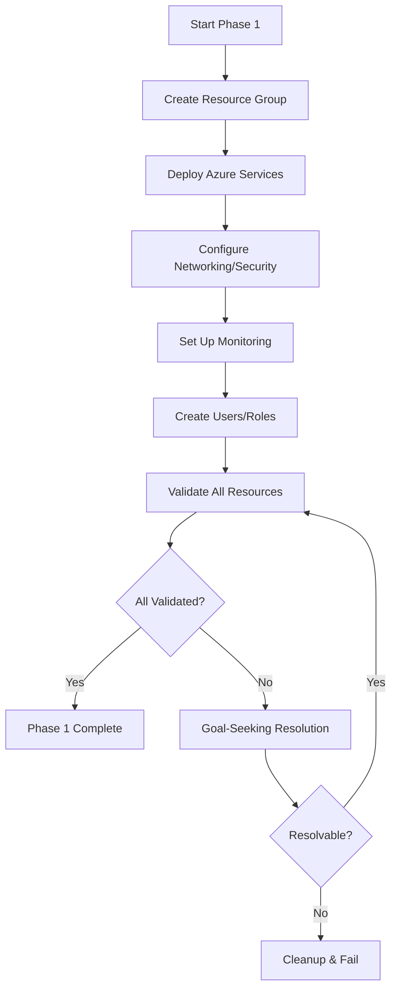

# Scenario Management Guide

## Table of Contents

- [Overview](#overview)
- [Scenario Structure](#scenario-structure)
- [The Three-Phase Model](#the-three-phase-model)
- [Creating New Scenarios](#creating-new-scenarios)
- [Scenario Checklist](#scenario-checklist)
- [Best Practices](#best-practices)
- [Example Scenarios](#example-scenarios)
- [Troubleshooting](#troubleshooting)

## Overview

Azure HayMaker scenarios are self-contained documentation packages that define complete operational lifecycles for Azure resources. Each scenario represents a realistic business use case executed by an autonomous agent to generate benign telemetry in an Azure tenant.

### What is a Scenario?

A scenario is a markdown document that describes:

1. **Context**: What business problem is being solved
2. **Deployment**: How to create the required Azure resources
3. **Operations**: What ongoing management activities to perform
4. **Cleanup**: How to completely remove all resources

### Scenario Lifecycle

Each scenario progresses through three phases:
1. **Phase 1 - Deployment**: Provision all required Azure resources
2. **Phase 2 - Operations**: Perform realistic management activities (8+ hours)
3. **Phase 3 - Cleanup**: Remove all resources and verify deletion

## Scenario Structure

### Required Sections

Every scenario must include these sections:

```markdown
# Scenario: [Descriptive Name]

## Technology Area
[AI & ML / Analytics / Compute / Containers / Databases / Hybrid+Multicloud / Identity / Networking / Security / Web Apps]

## Company Profile
- **Company Size**: [Small / Mid-size]
- **Industry**: [e.g., Retail, Healthcare, Finance]
- **Use Case**: [Brief description]

## Scenario Description
[2-3 sentences describing the implementation]

## Azure Services Used
- Service 1
- Service 2

## Prerequisites
- Requirements list

---

## Phase 1: Deployment and Validation
[Deployment commands and validation steps]

---

## Phase 2: Mid-Day Operations and Management
[Management operations commands]

---

## Phase 3: Cleanup and Tear-Down
[Cleanup commands and verification]

---

## Resource Naming Convention
[Naming patterns with UNIQUE_ID]

## Documentation References
[Links to Azure docs]

## Automation Tool
**Recommended**: [Azure CLI / Terraform / Bicep]
**Rationale**: [Why this tool]

## Estimated Duration
- **Deployment**: [X minutes]
- **Operations Phase**: [8 hours minimum]
- **Cleanup**: [X minutes]

## Notes
[Additional context]
```

### Directory Structure

Scenarios are organized by technology area:

```
docs/scenarios/
├── SCENARIO_TEMPLATE.md           # Template for new scenarios
├── SCALING_PLAN.md                # Roadmap for scenario expansion
├── ai-ml-01-cognitive-services-vision.md
├── ai-ml-02-text-analytics.md
├── analytics-01-batch-etl-pipeline.md
├── compute-01-linux-vm-web-server.md
├── containers-01-simple-web-app.md
├── databases-01-mysql-wordpress.md
├── hybrid-01-azure-arc.md
├── identity-01-service-principals.md
├── networking-01-virtual-network.md
├── security-01-key-vault-secrets.md
└── webapps-01-static-website.md
```

## The Three-Phase Model

Azure HayMaker scenarios follow a strict three-phase execution model that mirrors real-world operations.

### Phase 1: Deployment and Validation

**Purpose**: Provision all required Azure resources and verify they are operational.

**Duration**: 10-30 minutes typically

**Activities**:
- Create resource groups
- Deploy Azure services
- Configure networking and security
- Set up monitoring and logging
- Create user accounts and role assignments
- Validate successful deployment

**Example from compute-03-app-service-python**:

```bash
# Set variables with unique identifiers
UNIQUE_ID=$(date +%Y%m%d%H%M%S)
RESOURCE_GROUP="azurehaymaker-compute-${UNIQUE_ID}-rg"
LOCATION="eastus"
APP_SERVICE_PLAN="azurehaymaker-asp-${UNIQUE_ID}"
WEB_APP_NAME="azurehaymaker-py-app-${UNIQUE_ID}"
TAGS="AzureHayMaker-managed=true Scenario=compute-app-service-python"

# Create resource group
az group create \
  --name "${RESOURCE_GROUP}" \
  --location "${LOCATION}" \
  --tags ${TAGS}

# Create App Service Plan
az appservice plan create \
  --name "${APP_SERVICE_PLAN}" \
  --resource-group "${RESOURCE_GROUP}" \
  --sku B1 \
  --is-linux \
  --tags ${TAGS}

# Create Web App
az webapp create \
  --resource-group "${RESOURCE_GROUP}" \
  --plan "${APP_SERVICE_PLAN}" \
  --name "${WEB_APP_NAME}" \
  --runtime "PYTHON|3.9" \
  --tags ${TAGS}

# Validate deployment
az webapp show --resource-group "${RESOURCE_GROUP}" --name "${WEB_APP_NAME}"
```

**Validation Requirements**:
- All resources created successfully
- All resources properly tagged with `AzureHayMaker-managed=true`
- Resources accessible and functional
- Monitoring/logging configured



### Phase 2: Mid-Day Operations and Management

**Purpose**: Perform realistic ongoing management activities that generate operational telemetry.

**Duration**: Minimum 8 hours (continuous operations)

**Activities**:
- Monitor resource health and performance
- Adjust configurations
- Scale resources up/down
- Review logs and metrics
- Perform routine maintenance
- Update application settings
- Test endpoints and functionality
- Rotate credentials
- Update security policies

**Example from security-01-key-vault-secrets**:

```bash
# Operation 1: Create new secret version (credential rotation)
az keyvault secret set \
  --vault-name "${KEY_VAULT_NAME}" \
  --name "api-key" \
  --value "sk-$(openssl rand -hex 32)"

# Operation 2: List all versions of a secret
az keyvault secret list-versions \
  --vault-name "${KEY_VAULT_NAME}" \
  --name "api-key" \
  --output table

# Operation 3: Audit Key Vault access logs
az monitor activity-log list \
  --resource-group "${RESOURCE_GROUP}" \
  --caller-only \
  --output table

# Operation 4: Backup a secret
BACKUP_DIR="/tmp/kv-backup-${UNIQUE_ID}"
mkdir -p "${BACKUP_DIR}"
az keyvault secret backup \
  --vault-name "${KEY_VAULT_NAME}" \
  --name "api-key" \
  --file "${BACKUP_DIR}/api-key.backup"

# Operation 5: Check diagnostics settings
az monitor diagnostic-settings list \
  --resource "/subscriptions/$(az account show --query id -o tsv)/resourceGroups/${RESOURCE_GROUP}/providers/Microsoft.KeyVault/vaults/${KEY_VAULT_NAME}" \
  --output table
```

**Operation Patterns**:
- **Periodic checks**: Every 30-60 minutes
- **Metric collection**: Every 15-30 minutes
- **Configuration changes**: 2-3 times during phase
- **Log reviews**: Hourly
- **Health checks**: Every 10-15 minutes

**Benign Operations Only**:
- No destructive actions (except controlled tests)
- No data exfiltration
- No privilege escalation
- No lateral movement
- No security control bypass

### Phase 3: Cleanup and Tear-Down

**Purpose**: Completely remove all resources created during deployment and ensure nothing remains.

**Duration**: 5-15 minutes typically

**Activities**:
- Delete all created resources
- Remove role assignments
- Delete user accounts
- Verify complete resource removal
- Clean up local artifacts

**Example from compute-03-app-service-python**:

```bash
# Step 1: Delete the entire resource group
az group delete \
  --name "${RESOURCE_GROUP}" \
  --yes \
  --no-wait

# Step 2: Wait for deletion to complete
echo "Waiting for resource group deletion..."
sleep 120

# Step 3: Verify deletion
az group exists --name "${RESOURCE_GROUP}"

# Step 4: Confirm cleanup (should fail with "not found")
echo "Verifying cleanup..."
az resource list --resource-group "${RESOURCE_GROUP}" 2>&1 | \
  grep "could not be found" && \
  echo "✓ Resource group successfully deleted"

# Step 5: Clean up local files
rm -rf "${ARTIFACT_DIR}"
```

**Cleanup Requirements**:
- All Azure resources deleted
- Resource group deleted
- No orphaned resources
- All tags verified removed
- Local artifacts cleaned
- Service principal credentials cleared

**Verification**:
```bash
# Check for any remaining resources with HayMaker tag
az resource list --tag AzureHayMaker-managed=true --output table

# Should return empty or "no resources found"
```

## Creating New Scenarios

### Step 1: Choose Technology Area and Use Case

Select from the 10 technology areas defined in the Azure Architecture Center:

1. **AI & ML**: Cognitive Services, Azure OpenAI, Machine Learning
2. **Analytics**: Data pipelines, Synapse, Databricks, Power BI
3. **Compute**: VMs, App Service, Azure Functions, VM Scale Sets
4. **Containers**: AKS, Container Instances, Container Apps
5. **Databases**: SQL, MySQL, PostgreSQL, Cosmos DB, Redis
6. **Hybrid + Multicloud**: Azure Arc, Azure Stack, Site Recovery
7. **Identity**: Entra ID, Service Principals, RBAC, Managed Identity
8. **Networking**: VNets, VPN Gateway, Load Balancers, Application Gateway
9. **Security**: Key Vault, NSGs, Security Center, Defender
10. **Web Apps**: Static websites, App Service, API Management

**Identify a specific use case**:
- What business problem does it solve?
- What company profile would use this?
- What is the minimal viable implementation?

### Step 2: Research Azure Documentation

Use the Azure Architecture Center as your primary reference:

- Browse https://learn.microsoft.com/en-us/azure/architecture/
- Find reference architectures for your use case
- Review Azure service documentation
- Study quickstart guides and tutorials

**Collect information about**:
- Required Azure services
- Service dependencies
- Networking requirements
- Security considerations
- Cost implications
- Limitations and constraints

### Step 3: Copy the Template

```bash
# Copy the template
cp docs/scenarios/SCENARIO_TEMPLATE.md \
   docs/scenarios/[area]-[number]-[short-name].md

# Example:
cp docs/scenarios/SCENARIO_TEMPLATE.md \
   docs/scenarios/compute-06-container-apps.md
```

**Naming Convention**:
- `[area]`: Technology area (lowercase, hyphenated)
- `[number]`: Two-digit sequence (01-99)
- `[short-name]`: Brief descriptive name (3-5 words, hyphenated)

**Examples**:
- `ai-ml-03-azure-openai.md`
- `databases-02-cosmos-db.md`
- `networking-05-private-endpoint.md`

### Step 4: Define Company Profile

Create a realistic fictional company:

```markdown
## Company Profile
- **Company Size**: Small startup
- **Industry**: E-commerce / Retail
- **Use Case**: Deploy a scalable product catalog API with global distribution and sub-100ms response times
```

**Guidelines**:
- Keep it simple (small or mid-size companies)
- Choose common industries
- Define clear, specific use cases
- Avoid complex compliance requirements initially

### Step 5: Write Phase 1 - Deployment

**Start with environment setup**:

```bash
# Set variables
UNIQUE_ID=$(date +%Y%m%d%H%M%S)
RESOURCE_GROUP="azurehaymaker-[area]-${UNIQUE_ID}-rg"
LOCATION="eastus"
# ... additional variables

# Tags (REQUIRED)
TAGS="AzureHayMaker-managed=true Scenario=[scenario-id] Owner=AzureHayMaker"
```

**Write deployment commands**:
- Use Azure CLI, Terraform, or Bicep (be consistent)
- Include comments explaining each step
- Use variable substitution (not hardcoded values)
- Apply tags to ALL resources
- Capture output variables when needed

**Add validation**:
```bash
# Verify Resource Group
az group show --name "${RESOURCE_GROUP}"

# Verify primary service deployed
az [service] show --resource-group "${RESOURCE_GROUP}" --name "${SERVICE_NAME}"

# List all resources
az resource list --resource-group "${RESOURCE_GROUP}" --output table
```

### Step 6: Write Phase 2 - Operations

Define 10-15 realistic management operations:

```bash
# Operation 1: Monitor resource health
[command to check health/status]

# Operation 2: Review performance metrics
[command to collect metrics]

# Operation 3: Update configuration
[command to modify settings]

# ... continue with more operations
```

**Operation Categories**:
- **Monitoring**: Check health, metrics, logs
- **Maintenance**: Update settings, rotate credentials
- **Scaling**: Adjust capacity up/down
- **Security**: Review access, update policies
- **Testing**: Verify endpoints, run health checks

**Operation Frequency**:
- Some operations should run frequently (every 10-30 min)
- Others should be periodic (every 2-4 hours)
- Consider what real administrators would do

### Step 7: Write Phase 3 - Cleanup

Ensure complete removal:

```bash
# Step 1: Delete resource group (simplest approach)
az group delete \
  --name "${RESOURCE_GROUP}" \
  --yes \
  --no-wait

# Step 2: Wait for completion
sleep 120

# Step 3: Verify deletion
az group exists --name "${RESOURCE_GROUP}"

# Step 4: Confirm cleanup
az resource list --resource-group "${RESOURCE_GROUP}" 2>&1 | \
  grep "could not be found" && \
  echo "✓ Resource group successfully deleted"

# Step 5: Clean up local artifacts
rm -rf /tmp/scenario-artifacts-*
```

**Important**:
- Resource group deletion removes all contained resources
- Some resources (Key Vaults, etc.) may have soft-delete - handle appropriately
- Always verify deletion succeeded
- Clean up any local files created

### Step 8: Add Documentation References

Link to official Azure documentation:

```markdown
## Documentation References
- [Azure Service Name Overview](https://learn.microsoft.com/...)
- [Azure Service Name Quickstart](https://learn.microsoft.com/...)
- [Azure CLI Reference](https://learn.microsoft.com/cli/azure/...)
- [Best Practices Guide](https://learn.microsoft.com/...)
```

**Verify all links**:
```bash
# Check that all documentation links are valid
grep -o 'https://learn.microsoft.com[^)]*' your-scenario.md | \
  while read url; do
    curl -I "$url" 2>&1 | grep "HTTP" | grep -q "200" && \
      echo "✓ $url" || \
      echo "✗ $url"
  done
```

### Step 9: Test the Scenario

**Manual execution test**:

```bash
# Execute Phase 1 commands manually
# Copy/paste each command from your scenario document
# Verify each step succeeds

# Wait or execute some Phase 2 operations
# Test a few operations manually

# Execute Phase 3 cleanup
# Verify all resources removed
```

**Validation checklist**:
- [ ] All Phase 1 commands execute successfully
- [ ] All resources created and tagged properly
- [ ] Validation commands confirm deployment
- [ ] Phase 2 operations execute without errors
- [ ] Operations generate realistic telemetry
- [ ] Phase 3 cleanup removes all resources
- [ ] Cleanup verification confirms deletion
- [ ] No errors in any commands
- [ ] All documentation links valid

### Step 10: Simplify for Single Tenant/Subscription

Azure Architecture Center often shows multi-tenant or multi-subscription designs. **Simplify these**:

**Original (multi-subscription)**:
```bash
# Deploy to production subscription
az account set --subscription "prod-subscription"
az deployment create ...

# Deploy to development subscription
az account set --subscription "dev-subscription"
az deployment create ...
```

**Simplified (single subscription)**:
```bash
# Deploy to single subscription with environment tags
az deployment create \
  --resource-group "${RESOURCE_GROUP}" \
  --tags Environment=production ${TAGS}
```

**Document simplifications**:
```markdown
## Notes
- Original architecture from Azure Architecture Center uses multiple subscriptions
- This scenario simplifies to single subscription with tagging for differentiation
- In production, consider separate subscriptions for isolation
```

## Scenario Checklist

Use this checklist when creating or reviewing scenarios:

### Structure and Format
- [ ] File named according to convention: `[area]-[number]-[name].md`
- [ ] All required sections present (see template)
- [ ] Company profile is realistic
- [ ] Prerequisites clearly documented

### Phase 1: Deployment
- [ ] Uses `UNIQUE_ID` for resource uniqueness
- [ ] All resources tagged with `AzureHayMaker-managed=true`
- [ ] Commands use variables (no hardcoded values)
- [ ] Validation commands included
- [ ] All commands are copy-pasteable

### Phase 2: Operations
- [ ] Minimum 10 distinct operations
- [ ] Operations are realistic and benign
- [ ] Supports minimum 8-hour execution

### Phase 3: Cleanup
- [ ] Resource group deletion included
- [ ] Verification confirms all resources deleted
- [ ] Local artifacts cleaned up

### Quality Requirements
- [ ] All documentation links valid
- [ ] All commands tested
- [ ] No TODO or placeholder values
- [ ] All examples functional

## Best Practices

### Naming Conventions

**Always use unique identifiers**:
```bash
# Good - includes timestamp for uniqueness
UNIQUE_ID=$(date +%Y%m%d%H%M%S)
RESOURCE_GROUP="azurehaymaker-compute-${UNIQUE_ID}-rg"

# Bad - hardcoded, will conflict
RESOURCE_GROUP="azurehaymaker-compute-rg"
```

**Use consistent naming patterns**:
```bash
# Pattern: azurehaymaker-[context]-${UNIQUE_ID}-[type]
RESOURCE_GROUP="azurehaymaker-security-${UNIQUE_ID}-rg"
KEY_VAULT_NAME="azurehaymaker-kv-${UNIQUE_ID}"
WEB_APP_NAME="azurehaymaker-app-${UNIQUE_ID}"
STORAGE_ACCOUNT="azurehaymaker${UNIQUE_ID}"  # no hyphens for storage
```

### Tagging Strategy

**Required tag on ALL resources**:
```bash
TAGS="AzureHayMaker-managed=true Scenario=[scenario-id] Owner=AzureHayMaker"
```

**Apply tags consistently**:
```bash
# On resource group creation
az group create --name "${RESOURCE_GROUP}" --tags ${TAGS}

# On service creation
az webapp create --tags ${TAGS}

# On resource updates
az resource tag --tags ${TAGS}
```

**Query resources by tag**:
```bash
# Find all HayMaker-managed resources
az resource list --tag AzureHayMaker-managed=true --output table

# Find resources for specific scenario
az resource list --tag Scenario=compute-03-app-service-python --output table
```

### Command Documentation

**Always include explanatory comments**:
```bash
# Good - explains what and why
# Step 3: Create Application Insights for performance monitoring
az monitor app-insights component create \
  --app "${APP_INSIGHTS_NAME}" \
  --resource-group "${RESOURCE_GROUP}"

# Bad - no explanation
az monitor app-insights component create \
  --app "${APP_INSIGHTS_NAME}" \
  --resource-group "${RESOURCE_GROUP}"
```

### Error Handling

**Add fallback logic where appropriate**:
```bash
# Handles both main and master branch names
git push azure master 2>&1 || git push azure main 2>&1 || echo "Push attempted"

# Continues even if command fails
az keyvault secret delete --vault-name "${VAULT}" --name "${SECRET}" || true
```

### Variable Capture

**Capture outputs needed for later phases**:
```bash
# Capture for use in subsequent commands
WEB_APP_URL=$(az webapp show \
  --resource-group "${RESOURCE_GROUP}" \
  --name "${WEB_APP_NAME}" \
  --query defaultHostName -o tsv)

# Use the captured variable
curl "https://${WEB_APP_URL}/api/health"
```

### Azure Location Selection

**Use standard Azure regions**:
```bash
# Good - commonly available region
LOCATION="eastus"

# Good - European region
LOCATION="westeurope"

# Avoid - specialty regions
LOCATION="usgov-virginia"
```

### Scope to Single Tenant/Subscription

**All operations in one subscription**:
```bash
# Good - uses current subscription context
az group create --name "${RESOURCE_GROUP}" --location "${LOCATION}"

# Bad - switches subscriptions
az account set --subscription "other-sub"
```

**Use tags to differentiate environments**:
```bash
# Instead of multiple subscriptions, use tags
TAGS="Environment=production ${TAGS}"
TAGS="Environment=development ${TAGS}"
```

### Resource Cleanup Verification

**Always verify cleanup succeeded**:
```bash
# Delete resource group
az group delete --name "${RESOURCE_GROUP}" --yes --no-wait

# Wait for propagation
sleep 120

# Verify deletion
if az group exists --name "${RESOURCE_GROUP}" | grep -q "false"; then
  echo "✓ Resource group successfully deleted"
else
  echo "✗ Resource group still exists - cleanup failed"
fi
```

### Local Artifact Management

**Clean up temporary files**:
```bash
# Create temporary directory with unique identifier
ARTIFACT_DIR="/tmp/azurehaymaker-${UNIQUE_ID}"
mkdir -p "${ARTIFACT_DIR}"

# Use it during operations
cd "${ARTIFACT_DIR}"
# ... operations ...

# Clean up at end
rm -rf "${ARTIFACT_DIR}"
```

## Example Scenarios

### Example 1: Security-Focused Scenario (Key Vault)

This example demonstrates comprehensive secret management:

**Location**: `docs/scenarios/security-01-key-vault-secrets.md`

**Key Features**:
- Uses Azure CLI for straightforward secret operations
- Demonstrates managed identity integration
- Includes secret rotation and versioning
- Shows backup/restore operations
- Comprehensive audit logging

**Phase 1 Highlights**:
```bash
# Create Key Vault with RBAC authorization
az keyvault create \
  --resource-group "${RESOURCE_GROUP}" \
  --name "${KEY_VAULT_NAME}" \
  --enable-rbac-authorization \
  --tags ${TAGS}

# Create multiple types of secrets
az keyvault secret set --vault-name "${KEY_VAULT_NAME}" \
  --name "api-key" --value "sk-$(openssl rand -hex 32)"

az keyvault secret set --vault-name "${KEY_VAULT_NAME}" \
  --name "db-connection-string" --value "Server=..."

# Enable managed identity on Web App
az webapp identity assign \
  --resource-group "${RESOURCE_GROUP}" \
  --name "${WEB_APP_NAME}"

# Grant Key Vault access to managed identity
az keyvault set-policy \
  --name "${KEY_VAULT_NAME}" \
  --object-id "${IDENTITY_OID}" \
  --secret-permissions get list
```

**Phase 2 Highlights**:
```bash
# Operation: Secret rotation (creates new version)
az keyvault secret set \
  --vault-name "${KEY_VAULT_NAME}" \
  --name "api-key" \
  --value "sk-$(openssl rand -hex 32)"

# Operation: List all versions
az keyvault secret list-versions \
  --vault-name "${KEY_VAULT_NAME}" \
  --name "api-key"

# Operation: Backup secret
az keyvault secret backup \
  --vault-name "${KEY_VAULT_NAME}" \
  --name "api-key" \
  --file "${BACKUP_DIR}/api-key.backup"

# Operation: Audit logs
az monitor activity-log list \
  --resource-group "${RESOURCE_GROUP}" \
  --caller-only
```

**Why This Example Works**:
- Clear security focus with realistic operations
- Demonstrates Azure identity best practices
- Shows secret lifecycle management
- Includes compliance-relevant audit operations
- Completely automatable with Azure CLI

### Example 2: Compute-Focused Scenario (Python App Service)

This example demonstrates PaaS web application hosting:

**Location**: `docs/scenarios/compute-03-app-service-python.md`

**Key Features**:
- Creates actual Flask application code
- Uses local Git deployment
- Integrates Application Insights
- Demonstrates auto-scaling configuration
- Shows continuous deployment workflow

**Phase 1 Highlights**:
```bash
# Create Application Insights workspace
az monitor app-insights component create \
  --app "${APP_INSIGHTS_NAME}" \
  --resource-group "${RESOURCE_GROUP}" \
  --application-type web

# Create Python Flask app files
cat > "${ARTIFACT_DIR}/app.py" <<'EOF'
from flask import Flask, jsonify
app = Flask(__name__)

@app.route('/')
def home():
    return jsonify({'status': 'running', 'service': 'Azure HayMaker'})
EOF

# Deploy via Git
git init && git add . && git commit -m "Initial commit"
git remote add azure "${GIT_URL}"
git push azure main

# Configure auto-scaling
az monitor autoscale create \
  --resource-group "${RESOURCE_GROUP}" \
  --resource "${APP_SERVICE_PLAN}" \
  --min-count 1 --max-count 5
```

**Phase 2 Highlights**:
```bash
# Operation: Monitor CPU usage
az monitor metrics list \
  --resource "${RESOURCE_ID}" \
  --metric "CpuTime"

# Operation: View application logs
az webapp log tail \
  --resource-group "${RESOURCE_GROUP}" \
  --name "${WEB_APP_NAME}"

# Operation: Test endpoints
curl "https://${WEB_APP_URL}/api/health"
curl "https://${WEB_APP_URL}/api/info"

# Operation: Scale up
az appservice plan update \
  --resource-group "${RESOURCE_GROUP}" \
  --name "${APP_SERVICE_PLAN}" \
  --sku S1
```

**Why This Example Works**:
- Creates real, working application code
- Shows modern PaaS deployment pattern
- Demonstrates observability integration
- Includes realistic scaling operations
- End-to-end deployment workflow

### Example 3: Multi-Service Integration

For more complex scenarios, consider:

**Container-Based Architecture**:
```bash
# Phase 1: Deploy AKS cluster
az aks create --name "${CLUSTER_NAME}" --resource-group "${RESOURCE_GROUP}"

# Deploy containerized application
kubectl apply -f deployment.yaml

# Configure ingress
kubectl apply -f ingress.yaml
```

**Phase 2: Kubernetes Operations**:
```bash
# Scale deployment
kubectl scale deployment app --replicas=3

# Check pod status
kubectl get pods

# View logs
kubectl logs -f deployment/app

# Update configuration
kubectl apply -f updated-config.yaml
```

**Data Pipeline Architecture**:
```bash
# Phase 1: Create Synapse workspace
az synapse workspace create --name "${WORKSPACE}"

# Create SQL pool
az synapse sql pool create --name "${SQL_POOL}"

# Create Spark pool
az synapse spark pool create --name "${SPARK_POOL}"
```

**Phase 2: Analytics Operations**:
```bash
# Run SQL query
az synapse sql query --workspace-name "${WORKSPACE}" --sql-query "..."

# Submit Spark job
az synapse spark job submit --workspace-name "${WORKSPACE}" --file script.py

# Monitor pipeline runs
az synapse pipeline-run list --workspace-name "${WORKSPACE}"
```

## Troubleshooting

### Common Issues

#### Issue: Resource Names Already Exist

**Symptom**:
```
ERROR: The resource name 'azurehaymaker-app-123' already exists
```

**Solution**:
Ensure you're using `UNIQUE_ID` with timestamp:
```bash
# Correct approach
UNIQUE_ID=$(date +%Y%m%d%H%M%S)
APP_NAME="azurehaymaker-app-${UNIQUE_ID}"

# Add random suffix if conflicts persist
UNIQUE_ID="$(date +%Y%m%d%H%M%S)-$(openssl rand -hex 4)"
```

#### Issue: Tag Not Applied

**Symptom**:
Resources created but tag `AzureHayMaker-managed=true` missing

**Solution**:
Verify tag syntax and command format:
```bash
# Correct - tags as part of creation
az resource create --tags AzureHayMaker-managed=true

# Correct - tags applied after creation
az resource tag \
  --ids "${RESOURCE_ID}" \
  --tags AzureHayMaker-managed=true

# Verify tags
az resource show --ids "${RESOURCE_ID}" --query tags
```

#### Issue: Cleanup Doesn't Remove All Resources

**Symptom**:
After cleanup, some resources still exist

**Solution**:
Use forced cleanup with tag query:
```bash
# Query all resources with HayMaker tag
REMAINING=$(az resource list \
  --tag AzureHayMaker-managed=true \
  --query "[].id" -o tsv)

# Force delete each resource
for RESOURCE_ID in $REMAINING; do
  az resource delete --ids "${RESOURCE_ID}" --verbose
done

# Verify cleanup
az resource list --tag AzureHayMaker-managed=true
```

#### Issue: Service Principal Permissions Insufficient

**Symptom**:
```
ERROR: The client does not have authorization to perform action 'Microsoft.Resources/...'
```

**Solution**:
Verify required roles in scenario prerequisites:
```markdown
## Prerequisites
- Service principal must have:
  - Contributor role on subscription (for resource creation)
  - User Access Administrator (for role assignments)
  - Specific service roles as needed
```

Verify permissions:
```bash
# Check current assignments
az role assignment list \
  --assignee "${SERVICE_PRINCIPAL_ID}" \
  --output table
```

#### Issue: Documentation Links Broken

**Symptom**:
Links return 404 or redirect to generic pages

**Solution**:
Use the link checker:
```bash
# Extract and test all Microsoft Learn links
grep -o 'https://learn.microsoft.com[^)]*' scenario.md | \
  while read url; do
    STATUS=$(curl -I -s "$url" | grep "HTTP" | awk '{print $2}')
    if [ "$STATUS" = "200" ]; then
      echo "✓ $url"
    else
      echo "✗ $url (Status: $STATUS)"
    fi
  done
```

Update broken links:
- Search for current documentation on learn.microsoft.com
- Update scenario with correct URL
- Re-test all links

#### Issue: Commands Use Hardcoded Values

**Symptom**:
Commands contain literal values instead of variables

**Solution**:
Refactor to use variables:
```bash
# Bad - hardcoded values
az group create --name "my-group" --location "eastus"

# Good - variables
RESOURCE_GROUP="azurehaymaker-compute-${UNIQUE_ID}-rg"
LOCATION="eastus"
az group create --name "${RESOURCE_GROUP}" --location "${LOCATION}"
```

#### Issue: Phase 2 Operations Too Short

**Symptom**:
All Phase 2 operations complete in minutes, not hours

**Solution**:
Add realistic operational loop:
```bash
# Phase 2 should span 8+ hours
OPERATION_COUNT=0
MAX_OPERATIONS=96  # 8 hours * 12 operations per hour

while [ $OPERATION_COUNT -lt $MAX_OPERATIONS ]; do
  # Perform monitoring operation
  az monitor metrics list ...

  # Check health
  curl "${HEALTH_ENDPOINT}"

  # Review logs
  az webapp log tail --lines 20

  # Increment and wait
  OPERATION_COUNT=$((OPERATION_COUNT + 1))
  echo "Completed operation ${OPERATION_COUNT}/${MAX_OPERATIONS}"
  sleep 300  # Wait 5 minutes between operations
done
```


---

## Summary

Creating high-quality scenarios requires:

1. **Clear Structure**: Follow the three-phase model consistently
2. **Realistic Operations**: Model real-world administrative activities
3. **Complete Automation**: All commands must be copy-pasteable and functional
4. **Proper Tagging**: Enable resource tracking and cleanup verification
5. **Comprehensive Cleanup**: Ensure no resources remain after execution

For additional examples, see the 50+ scenarios in `docs/scenarios/`.
