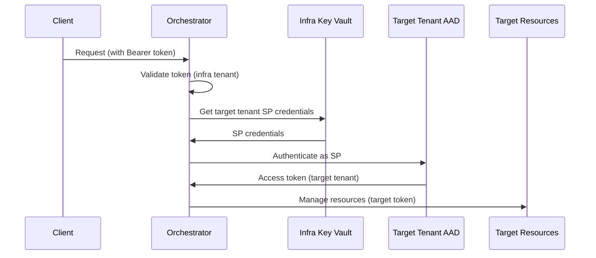

# Cross-Tenant Orchestration Security Architecture

## Document Control

- Status: Design Document
- Version: 1.0
- Last Updated: 2025-12-09
- Security Review Required: YES
- Threat Model Review Required: YES

## Executive Summary

This document defines the security architecture for cross-tenant orchestration in AzureHayMaker, where an orchestrator in an "infrastructure tenant" manages resources across multiple "target tenants".

CRITICAL REQUIREMENT: Zero cross-tenant data leakage is NON-NEGOTIABLE.

## Table of Contents

1. [Architecture Overview](#architecture-overview)
2. [Credential Management Security](#credential-management-security)
3. [Tenant Isolation](#tenant-isolation)
4. [Authentication and Authorization](#authentication-and-authorization)
5. [Storage Security](#storage-security)
6. [Audit and Compliance](#audit-and-compliance)
7. [Threat Model](#threat-model)
8. [Security Testing Requirements](#security-testing-requirements)
9. [Implementation Guidelines](#implementation-guidelines)
10. [Code Review Checklist](#code-review-checklist)

---

## Architecture Overview

### Tenancy Model

```
Infrastructure Tenant (Orchestrator)
├── Orchestrator Service (Container App / Function App)
├── Key Vault (per-tenant credentials)
├── Storage Account (execution state, audit logs)
├── Service Bus (event routing)
└── Managed Identity (orchestrator identity)

Target Tenant A
├── Service Principal (created by orchestrator)
├── Resources (managed by agent)
└── Audit Logs

Target Tenant B
├── Service Principal (created by orchestrator)
├── Resources (managed by agent)
└── Audit Logs
```

### Key Principles

1. Orchestrator has NO direct access to target tenant resources
2. Each target tenant has its own dedicated Service Principal
3. Credentials are NEVER shared across tenants
4. All queries MUST filter by tenant_id
5. Fail secure - deny by default

---

## Credential Management Security

### 1.1 Per-Tenant Service Principal Credentials

#### Storage Strategy

Use Azure Key Vault with **per-tenant secret isolation**:

```python
# Key Vault Naming Convention
ORCHESTRATOR_KEY_VAULT = "haymaker-infra-kv"

# Secret naming convention: tenant-{tenant_id}-sp-{purpose}
# Example secrets:
# - tenant-aaaabbbb-cccc-dddd-eeee-ffffffffffff-sp-client-id
# - tenant-aaaabbbb-cccc-dddd-eeee-ffffffffffff-sp-client-secret
# - tenant-11112222-3333-4444-5555-666666666666-sp-client-id
# - tenant-11112222-3333-4444-5555-666666666666-sp-client-secret

def get_secret_name(tenant_id: str, credential_type: str) -> str:
    """Generate Key Vault secret name for tenant credential.

    Args:
        tenant_id: Azure AD tenant ID (validated UUID)
        credential_type: Type of credential (client-id, client-secret, etc.)

    Returns:
        Secret name following naming convention
    """
    # Validate tenant_id is UUID
    try:
        uuid.UUID(tenant_id)
    except ValueError:
        raise ValueError(f"Invalid tenant_id: {tenant_id}")

    # Validate credential type
    allowed_types = {"client-id", "client-secret", "tenant-id"}
    if credential_type not in allowed_types:
        raise ValueError(f"Invalid credential_type: {credential_type}")

    return f"tenant-{tenant_id}-sp-{credential_type}"
```

#### Secret Rotation Strategy

```python
class TenantCredentialRotation:
    """Handles per-tenant credential rotation with zero downtime."""

    async def rotate_credentials(
        self,
        tenant_id: str,
        kv_client: SecretClient,
        graph_client: GraphServiceClient,
    ) -> None:
        """Rotate service principal credentials for a tenant.

        Process:
        1. Create new SP credential (secret2)
        2. Store in Key Vault with -new suffix
        3. Wait for propagation (60s)
        4. Update agents to use new credential
        5. Verify agents functioning
        6. Delete old credential
        7. Rename -new secret to primary
        """
        # Implementation follows blue-green deployment pattern
        pass
```

Rotation schedule:
- Automatic rotation: Every 90 days
- Emergency rotation: On-demand via API
- Notification: 7 days before expiration

#### Principle of Least Privilege

Orchestrator Service Principal:
- Scope: Infrastructure tenant ONLY
- Permissions:
  - Key Vault Secrets Officer (infrastructure KV)
  - Storage Blob Data Contributor (orchestrator storage)
  - Service Bus Data Owner (orchestrator service bus)
  - **NO access to target tenants**

Target Tenant Service Principals:
- Scope: Single target tenant ONLY
- Permissions (per tenant):
  - Contributor (scoped to resource group OR subscription)
  - **NO cross-tenant permissions**
  - **NO infrastructure tenant access**

### 1.2 Key Vault Security Configuration

```python
# Key Vault Security Settings
KEY_VAULT_CONFIG = {
    "sku_name": "premium",  # HSM-backed for production
    "enable_rbac_authorization": True,  # Use RBAC, not access policies
    "enable_soft_delete": True,
    "soft_delete_retention_days": 90,
    "enable_purge_protection": True,  # Cannot delete secrets permanently
    "network_acls": {
        "default_action": "Deny",  # Deny by default
        "bypass": "AzureServices",
        "virtual_network_rules": [
            {
                "subnet_id": "/subscriptions/.../subnets/orchestrator-subnet"
            }
        ]
    },
    "public_network_access": "Disabled",  # No public access
}
```

#### Secure Credential Retrieval

```python
async def get_tenant_credentials(
    tenant_id: str,
    kv_client: SecretClient,
) -> TenantCredentials:
    """Retrieve tenant service principal credentials from Key Vault.

    Security:
    - Input validation (UUID format for tenant_id)
    - Audit logging of access
    - Time-constant comparison for tenant_id
    - Never log credential values
    """
    # Validate tenant_id format
    validate_uuid(tenant_id)

    # Audit log credential access
    logger.audit(
        "credential_access",
        tenant_id=tenant_id,
        user=get_current_user(),
        timestamp=datetime.utcnow().isoformat(),
    )

    # Retrieve secrets
    try:
        client_id_secret = await kv_client.get_secret(
            get_secret_name(tenant_id, "client-id")
        )
        client_secret_secret = await kv_client.get_secret(
            get_secret_name(tenant_id, "client-secret")
        )
        tenant_id_secret = await kv_client.get_secret(
            get_secret_name(tenant_id, "tenant-id")
        )
    except ResourceNotFoundError:
        # Do NOT log which secret was missing (info leak)
        logger.error(f"Credentials not found for tenant")
        raise CredentialNotFoundError("Tenant credentials not configured")

    return TenantCredentials(
        tenant_id=tenant_id_secret.value,
        client_id=client_id_secret.value,
        client_secret=client_secret_secret.value,
    )
```

---

## Tenant Isolation

### 2.1 Data Isolation in Storage

#### Table Storage Partition Strategy

All storage queries MUST include tenant_id:

```python
class TenantIsolatedTableClient:
    """Table client that enforces tenant_id filtering."""

    def __init__(self, table_client: TableClient, tenant_id: str):
        self._client = table_client
        self._tenant_id = tenant_id

        # Validate tenant_id on construction
        validate_uuid(tenant_id)

    async def query_entities(
        self,
        filter_query: str = "",
        **kwargs
    ) -> AsyncItemPaged[TableEntity]:
        """Query entities with mandatory tenant_id filter.

        Security: ALWAYS adds tenant_id filter to prevent cross-tenant queries.
        """
        # Sanitize tenant_id to prevent OData injection
        safe_tenant_id = sanitize_odata_value(self._tenant_id)

        # Construct filter with mandatory tenant_id clause
        tenant_filter = f"tenant_id eq '{safe_tenant_id}'"

        if filter_query:
            # Combine filters with AND
            combined_filter = f"({tenant_filter}) and ({filter_query})"
        else:
            combined_filter = tenant_filter

        # Log query for audit
        logger.audit(
            "storage_query",
            tenant_id=self._tenant_id,
            filter=combined_filter,
        )

        return await self._client.query_entities(
            query_filter=combined_filter,
            **kwargs
        )

    async def get_entity(
        self,
        partition_key: str,
        row_key: str,
    ) -> TableEntity:
        """Get entity with tenant_id validation."""
        entity = await self._client.get_entity(partition_key, row_key)

        # Verify tenant_id matches
        if entity.get("tenant_id") != self._tenant_id:
            logger.security_alert(
                "Cross-tenant access attempt detected",
                tenant_id=self._tenant_id,
                entity_tenant_id=entity.get("tenant_id"),
            )
            raise PermissionError("Access denied: tenant_id mismatch")

        return entity
```

#### Cosmos DB Row-Level Security

Use Cosmos DB partition key = tenant_id:

```python
# Cosmos DB Configuration
COSMOS_DB_CONFIG = {
    "partition_key_path": "/tenant_id",  # Mandatory partition key
    "enable_automatic_id_generation": False,
}

class TenantIsolatedCosmosClient:
    """Cosmos DB client with tenant isolation."""

    async def query_items(
        self,
        tenant_id: str,
        query: str,
        **kwargs
    ) -> AsyncItemPaged:
        """Query items with partition key isolation."""
        # Validate tenant_id
        validate_uuid(tenant_id)

        # Enable partition key in query
        return await self.container.query_items(
            query=query,
            partition_key=tenant_id,  # Enforces partition isolation
            **kwargs
        )
```

### 2.2 Authentication Token Validation

#### Multi-Tenant Token Validation

```python
async def validate_multi_tenant_token(
    token: str,
    expected_tenant_id: str,
) -> dict:
    """Validate Azure AD token and verify tenant.

    Security:
    - Validates token signature
    - Checks expiration
    - Verifies issuer matches expected tenant
    - Validates audience
    """
    import jwt
    from jwt import PyJWKClient

    # Decode token header to get kid (key ID)
    unverified_header = jwt.get_unverified_header(token)
    kid = unverified_header.get("kid")

    # Fetch JWKS for expected tenant
    jwks_url = f"https://login.microsoftonline.com/{expected_tenant_id}/discovery/v2.0/keys"
    jwks_client = PyJWKClient(jwks_url)
    signing_key = jwks_client.get_signing_key(kid)

    # Verify token
    try:
        claims = jwt.decode(
            token,
            signing_key.key,
            algorithms=["RS256"],
            audience=f"api://{os.getenv('AZURE_CLIENT_ID')}",
            issuer=f"https://login.microsoftonline.com/{expected_tenant_id}/v2.0",
        )
    except jwt.InvalidTokenError as e:
        logger.security_alert(
            "Invalid token",
            expected_tenant=expected_tenant_id,
            error=str(e),
        )
        raise HTTPException(
            status_code=401,
            detail="Invalid authentication token",
        )

    # Verify tid (tenant ID) claim matches
    token_tenant = claims.get("tid")
    if not secrets.compare_digest(token_tenant, expected_tenant_id):
        logger.security_alert(
            "Tenant ID mismatch",
            expected=expected_tenant_id,
            actual=token_tenant,
        )
        raise HTTPException(
            status_code=403,
            detail="Access denied: tenant mismatch",
        )

    return claims
```

### 2.3 RBAC Boundaries

Orchestrator RBAC (Infrastructure Tenant):
- NO cross-tenant access
- NO service principal creation in target tenants
- NO resource access in target tenants

Target Tenant Service Principals:
- Scoped to single tenant
- NO access to infrastructure tenant
- NO access to other target tenants

```python
# Enforcement pattern
async def validate_rbac_scope(
    resource_id: str,
    tenant_id: str,
) -> None:
    """Validate resource is in expected tenant scope."""
    # Parse resource ID
    # Format: /subscriptions/{sub}/resourceGroups/{rg}/...
    parsed = parse_resource_id(resource_id)

    # Get subscription's tenant
    subscription_tenant = await get_subscription_tenant(parsed.subscription_id)

    # Verify match
    if not secrets.compare_digest(subscription_tenant, tenant_id):
        logger.security_alert(
            "Cross-tenant resource access attempt",
            expected_tenant=tenant_id,
            resource_tenant=subscription_tenant,
            resource_id=resource_id,
        )
        raise PermissionError("Resource not in tenant scope")
```

### 2.4 Network Isolation

VNet Integration (MANDATORY):

```python
# Orchestrator Container Apps Configuration
CONTAINER_APPS_CONFIG = {
    "vnet_integration": {
        "enabled": True,  # MANDATORY
        "subnet_id": "/subscriptions/.../subnets/orchestrator-apps-subnet",
    },
    "ingress": {
        "external": False,  # Internal only
        "target_port": 8080,
        "allow_insecure": False,  # HTTPS only
    },
}

# Network Security Groups
NSG_RULES = {
    "orchestrator_subnet": [
        {
            "name": "AllowKeyVaultOutbound",
            "priority": 100,
            "direction": "Outbound",
            "destination_address_prefix": "AzureKeyVault.{region}",
            "destination_port_range": "443",
            "protocol": "Tcp",
            "access": "Allow",
        },
        {
            "name": "AllowStorageOutbound",
            "priority": 110,
            "direction": "Outbound",
            "destination_address_prefix": "Storage.{region}",
            "destination_port_range": "443",
            "protocol": "Tcp",
            "access": "Allow",
        },
        {
            "name": "DenyInternetOutbound",
            "priority": 4000,
            "direction": "Outbound",
            "destination_address_prefix": "Internet",
            "destination_port_range": "*",
            "protocol": "*",
            "access": "Deny",
        },
    ]
}
```

---

## Authentication and Authorization

### 3.1 Authentication Flow



### 3.2 Service Principal Authentication

```python
class TenantAuthenticationManager:
    """Manages authentication to target tenants."""

    def __init__(self, kv_client: SecretClient):
        self._kv_client = kv_client
        self._token_cache: dict[str, TokenCache] = {}

    async def get_target_tenant_credential(
        self,
        tenant_id: str,
    ) -> ClientSecretCredential:
        """Get credential for target tenant."""
        # Retrieve SP credentials from Key Vault
        creds = await get_tenant_credentials(tenant_id, self._kv_client)

        # Create credential
        credential = ClientSecretCredential(
            tenant_id=creds.tenant_id,
            client_id=creds.client_id,
            client_secret=creds.client_secret,
        )

        return credential

    async def get_target_tenant_token(
        self,
        tenant_id: str,
        scope: str = "https://management.azure.com/.default",
    ) -> str:
        """Get access token for target tenant with caching."""
        cache_key = f"{tenant_id}:{scope}"

        # Check cache
        if cache_key in self._token_cache:
            cached = self._token_cache[cache_key]
            if not cached.is_expired():
                return cached.token

        # Get fresh token
        credential = await self.get_target_tenant_credential(tenant_id)
        token_response = await credential.get_token(scope)

        # Cache token
        self._token_cache[cache_key] = TokenCache(
            token=token_response.token,
            expires_on=token_response.expires_on,
        )

        return token_response.token
```

### 3.3 Managed Identity vs Service Principal

Decision Matrix:

| Component | Identity Type | Justification |
|-----------|--------------|---------------|
| Orchestrator API | Managed Identity | Deployed in infrastructure tenant, no credentials to manage |
| Target Tenant Access | Service Principal | Managed Identity cannot cross tenants |
| Key Vault Access | Managed Identity + RBAC | Orchestrator uses MI, no secrets needed |
| Storage Access | Managed Identity + RBAC | Same as Key Vault |

---

## Storage Security

### 4.1 Query Firewall Pattern

ALL database queries MUST use this pattern:

```python
class QueryFirewall:
    """Enforces tenant_id filtering on ALL queries."""

    @staticmethod
    def validate_query(
        query: str,
        tenant_id: str,
    ) -> str:
        """Validate and enforce tenant_id in query.

        Raises ValueError if query attempts to bypass tenant filtering.
        """
        # Sanitize tenant_id
        safe_tenant_id = sanitize_odata_value(tenant_id)

        # Check if query already has tenant_id filter
        if "tenant_id" not in query.lower():
            # Inject tenant_id filter
            if "where" in query.lower():
                query = query.replace(
                    "WHERE",
                    f"WHERE tenant_id = '{safe_tenant_id}' AND",
                    1
                )
            else:
                query += f" WHERE tenant_id = '{safe_tenant_id}'"

        # Verify no attempts to bypass (OR, NOT, etc.)
        dangerous_patterns = [
            r"tenant_id\s*(!=|<>)",  # Not equals
            r"tenant_id\s+not\s+in",  # NOT IN
            r"\bor\b.*tenant_id",  # OR bypass
        ]

        for pattern in dangerous_patterns:
            if re.search(pattern, query, re.IGNORECASE):
                logger.security_alert(
                    "Query bypass attempt detected",
                    query=query,
                    pattern=pattern,
                )
                raise ValueError("Invalid query: tenant bypass detected")

        return query
```

### 4.2 Blob Storage SAS Token Scoping

Generate SAS tokens scoped to tenant:

```python
async def generate_tenant_scoped_sas(
    tenant_id: str,
    container_name: str,
    blob_name: str,
    permission: str = "r",
    expiry_hours: int = 1,
) -> str:
    """Generate SAS token scoped to tenant's data."""
    # Validate tenant_id
    validate_uuid(tenant_id)

    # Enforce blob path includes tenant_id
    expected_prefix = f"tenants/{tenant_id}/"
    if not blob_name.startswith(expected_prefix):
        raise ValueError(f"Blob must be in tenant directory: {expected_prefix}")

    # Generate SAS
    from azure.storage.blob import generate_blob_sas, BlobSasPermissions

    sas_token = generate_blob_sas(
        account_name=os.getenv("STORAGE_ACCOUNT_NAME"),
        container_name=container_name,
        blob_name=blob_name,
        account_key=await get_storage_key(),
        permission=BlobSasPermissions.from_string(permission),
        expiry=datetime.utcnow() + timedelta(hours=expiry_hours),
    )

    return sas_token
```

### 4.3 Storage Account Configuration

```python
STORAGE_ACCOUNT_CONFIG = {
    "allow_blob_public_access": False,  # No anonymous access
    "enable_https_traffic_only": True,
    "minimum_tls_version": "TLS1_2",
    "network_rule_set": {
        "default_action": "Deny",
        "bypass": "AzureServices",
        "virtual_network_rules": [
            {
                "subnet_id": "/subscriptions/.../subnets/orchestrator-subnet"
            }
        ],
    },
    "encryption": {
        "key_source": "Microsoft.Keyvault",  # Customer-managed keys
        "keyvault_properties": {
            "key_name": "storage-encryption-key",
            "key_vault_uri": "https://haymaker-infra-kv.vault.azure.net",
        },
    },
}
```

---

## Audit and Compliance

### 5.1 Audit Logging Requirements

EVERY operation MUST log:

```python
@dataclass
class AuditLogEntry:
    """Structured audit log entry."""
    timestamp: str  # ISO 8601
    event_type: str  # credential_access, storage_query, resource_operation, etc.
    tenant_id: str  # Target tenant ID
    user_id: str  # Orchestrator identity or user
    resource_id: Optional[str]  # Azure resource ID if applicable
    operation: str  # create, read, update, delete
    status: str  # success, failure
    error_code: Optional[str]  # If failure
    source_ip: str  # Request source
    user_agent: str  # Client user agent

# Audit logging decorator
def audit_log(event_type: str):
    """Decorator to automatically audit function calls."""
    def decorator(func):
        @wraps(func)
        async def wrapper(*args, **kwargs):
            # Extract tenant_id from args/kwargs
            tenant_id = extract_tenant_id(args, kwargs)

            try:
                result = await func(*args, **kwargs)

                # Log success
                logger.audit(
                    event_type=event_type,
                    tenant_id=tenant_id,
                    operation=func.__name__,
                    status="success",
                    timestamp=datetime.utcnow().isoformat(),
                )

                return result
            except Exception as e:
                # Log failure
                logger.audit(
                    event_type=event_type,
                    tenant_id=tenant_id,
                    operation=func.__name__,
                    status="failure",
                    error_code=type(e).__name__,
                    timestamp=datetime.utcnow().isoformat(),
                )
                raise
        return wrapper
    return decorator
```

### 5.2 Tenant Context in Logs

ALL log messages MUST include tenant_id:

```python
# Configure structured logging
import structlog

logger = structlog.get_logger()

# Bind tenant context
logger = logger.bind(tenant_id=tenant_id)

# All subsequent logs will include tenant_id
logger.info("Operation started")  # Includes tenant_id automatically
```

### 5.3 Compliance Requirements

Data Residency:
- Tenant data MUST remain in tenant's specified region
- Cross-region replication MUST respect tenant boundaries
- Geo-redundancy MUST NOT cross tenant boundaries

```python
REGION_CONSTRAINTS = {
    "tenant-aaaabbbb-cccc-dddd-eeee-ffffffffffff": {
        "primary_region": "westeurope",
        "allowed_regions": ["westeurope", "northeurope"],
        "data_residency": "EU",
    },
    "tenant-11112222-3333-4444-5555-666666666666": {
        "primary_region": "eastus",
        "allowed_regions": ["eastus", "westus", "centralus"],
        "data_residency": "US",
    },
}

async def validate_region_compliance(
    tenant_id: str,
    resource_location: str,
) -> None:
    """Validate resource location complies with tenant data residency."""
    constraints = REGION_CONSTRAINTS.get(tenant_id)
    if not constraints:
        raise ValueError(f"No region constraints for tenant: {tenant_id}")

    if resource_location not in constraints["allowed_regions"]:
        raise ComplianceError(
            f"Region {resource_location} not allowed for tenant {tenant_id}"
        )
```

### 5.4 Secrets Access Auditing

Key Vault diagnostic settings:

```python
KEY_VAULT_DIAGNOSTICS = {
    "logs": [
        {
            "category": "AuditEvent",
            "enabled": True,
            "retention_policy": {
                "enabled": True,
                "days": 365,  # 1 year retention
            },
        }
    ],
    "metrics": [
        {
            "category": "AllMetrics",
            "enabled": True,
        }
    ],
    "log_analytics_destination_type": "Dedicated",
}
```

---

## Threat Model

### 6.1 Threat: Orchestrator Compromise

Attack: Attacker gains access to orchestrator service.

Impact: HIGH - Could access all tenant credentials in Key Vault.

Mitigations:
1. Key Vault network isolation (VNet-only access)
2. Managed Identity with time-limited tokens
3. Key Vault RBAC with least privilege
4. Audit logging of all Key Vault access
5. Alert on anomalous Key Vault access patterns
6. Soft delete + purge protection on Key Vault
7. Private endpoints for all Azure services

Detection:
- Monitor Key Vault access logs for:
  - Access outside business hours
  - Bulk secret retrievals
  - Access from unexpected IPs
  - Access to multiple tenants in short time

Response:
1. Revoke orchestrator Managed Identity permissions
2. Rotate ALL tenant service principal credentials
3. Review audit logs for compromised tenants
4. Notify affected tenants

### 6.2 Threat: Tenant Credential Leakage

Attack: Single tenant's service principal credentials are leaked.

Impact: MEDIUM - Affects single tenant only (isolated).

Mitigations:
1. Per-tenant credential isolation
2. Short-lived credentials (90-day rotation)
3. Least privilege RBAC per tenant
4. Audit logging in target tenant
5. Separate Key Vault secrets per tenant
6. No credential caching in orchestrator

Detection:
- Monitor target tenant for:
  - Access from unexpected IPs
  - Access outside normal hours
  - Unusual resource operations
  - Bulk resource creation/deletion

Response:
1. Rotate affected tenant credentials immediately
2. Review affected tenant audit logs
3. Notify affected tenant
4. No impact to other tenants (isolation verified)

### 6.3 Threat: SQL/NoSQL Injection in tenant_id

Attack: Attacker manipulates tenant_id to access other tenants' data.

Impact: CRITICAL - Cross-tenant data leakage.

Mitigations:
1. Input validation (UUID format only)
2. Parameterized queries (no string concatenation)
3. OData value sanitization
4. Query firewall pattern
5. Allowlist validation for tenant_id
6. Static analysis for query construction

Example Attack:
```python
# VULNERABLE (DO NOT DO THIS)
tenant_id = request.args.get("tenant_id")
query = f"PartitionKey eq '{tenant_id}'"  # INJECTION RISK!

# SECURE
tenant_id = validate_uuid(request.args.get("tenant_id"))
safe_tenant_id = sanitize_odata_value(tenant_id)
query = f"PartitionKey eq '{safe_tenant_id}'"
```

Detection:
- Static code analysis (detect string concatenation in queries)
- Runtime query validation (QueryFirewall pattern)
- Anomalous query patterns (multiple tenants in single session)

### 6.4 Threat: Privilege Escalation

Attack: Orchestrator gains unauthorized access to target tenant.

Impact: HIGH - Compromises tenant isolation.

Mitigations:
1. Service Principal scope limited to single tenant
2. No cross-tenant RBAC assignments
3. RBAC validation before resource operations
4. Azure Policy enforcement
5. Resource scope validation

Detection:
- Monitor for:
  - RBAC assignments across tenants
  - Resource access outside tenant scope
  - Service Principal permissions changes

### 6.5 Threat: Token Confusion Attack

Attack: Use token from one tenant to access another tenant.

Impact: CRITICAL - Cross-tenant access.

Mitigations:
1. Token issuer validation (per-tenant)
2. Token tenant ID (tid) claim validation
3. Time-constant comparison for tenant IDs
4. Separate credential stores per tenant
5. No token caching across tenants

Detection:
- Token validation failures
- Tenant ID mismatches in logs
- Cross-tenant token usage attempts

---

## Security Testing Requirements

### 7.1 Unit Tests

MANDATORY unit tests:

```python
class TestTenantIsolation:
    """Test tenant isolation guarantees."""

    def test_query_includes_tenant_id(self):
        """Verify all queries include tenant_id filter."""
        client = TenantIsolatedTableClient(mock_client, "tenant-a")
        client.query_entities("status eq 'active'")

        # Verify tenant_id in query
        assert "tenant_id eq 'tenant-a'" in captured_query

    def test_cross_tenant_access_blocked(self):
        """Verify cross-tenant access is blocked."""
        client = TenantIsolatedTableClient(mock_client, "tenant-a")

        # Entity belongs to tenant-b
        mock_entity = {"tenant_id": "tenant-b", "data": "secret"}

        with pytest.raises(PermissionError, match="tenant_id mismatch"):
            client.get_entity("partition", "row")

    def test_injection_attack_blocked(self):
        """Verify injection attacks are blocked."""
        malicious_tenant_id = "tenant-a' or '1'='1"

        with pytest.raises(ValueError):
            validate_uuid(malicious_tenant_id)

    def test_credential_isolation(self):
        """Verify credentials are isolated per tenant."""
        creds_a = await get_tenant_credentials("tenant-a", kv_client)
        creds_b = await get_tenant_credentials("tenant-b", kv_client)

        assert creds_a.client_id != creds_b.client_id
        assert creds_a.client_secret != creds_b.client_secret
```

### 7.2 Integration Tests

```python
class TestCrossTenantSecurity:
    """Integration tests for cross-tenant security."""

    @pytest.mark.integration
    async def test_tenant_a_cannot_access_tenant_b_resources(self):
        """Verify tenant A cannot access tenant B resources."""
        # Authenticate as tenant A
        client_a = await authenticate_tenant("tenant-a")

        # Attempt to access tenant B resource
        with pytest.raises(PermissionError):
            await client_a.query_entities(
                filter_query="tenant_id eq 'tenant-b'"
            )

    @pytest.mark.integration
    async def test_orchestrator_cannot_directly_access_tenant(self):
        """Verify orchestrator has no direct tenant access."""
        orchestrator_token = await get_orchestrator_token()

        # Attempt to access target tenant resource
        with pytest.raises(AuthenticationError):
            await ResourceManagementClient(
                credential=orchestrator_token,
                subscription_id=target_tenant_subscription,
            ).resource_groups.list()
```

### 7.3 Penetration Testing Checklist

Manual security tests:

1. Injection Attacks:
   - [ ] SQL injection in tenant_id parameters
   - [ ] OData injection in filter queries
   - [ ] Path traversal in resource IDs
   - [ ] Command injection in resource names

2. Authentication Bypass:
   - [ ] Token replay attacks
   - [ ] Token from wrong tenant
   - [ ] Expired token acceptance
   - [ ] Missing token handling

3. Authorization Bypass:
   - [ ] Cross-tenant resource access
   - [ ] Privilege escalation attempts
   - [ ] RBAC boundary violations

4. Data Leakage:
   - [ ] Cross-tenant query results
   - [ ] Credentials in logs
   - [ ] Credentials in error messages
   - [ ] Tenant data in shared storage

5. Network Security:
   - [ ] Public endpoint exposure
   - [ ] TLS version enforcement
   - [ ] Certificate validation

### 7.4 Automated Security Scanning

Tools to run:

1. SAST (Static Application Security Testing):
   - Bandit (Python security linter)
   - Semgrep (custom rules for tenant_id validation)
   - CodeQL (GitHub Advanced Security)

2. DAST (Dynamic Application Security Testing):
   - OWASP ZAP (API security testing)
   - Burp Suite (manual testing)

3. Dependency Scanning:
   - Dependabot (GitHub)
   - Safety (Python package vulnerabilities)

4. Secret Scanning:
   - TruffleHog (git history)
   - detect-secrets (pre-commit hook)

---

## Implementation Guidelines

### 8.1 Secure Coding Patterns

#### Pattern 1: Always Validate tenant_id

```python
def validate_tenant_id(tenant_id: str) -> str:
    """Validate tenant_id format and return safe value."""
    try:
        # Validate UUID format
        uuid_obj = uuid.UUID(tenant_id)
        # Return normalized form (lowercase, no hyphens optional)
        return str(uuid_obj)
    except ValueError:
        raise ValueError(f"Invalid tenant_id format: {tenant_id}")
```

#### Pattern 2: Use Parameterized Queries

```python
# WRONG - String concatenation
query = f"SELECT * FROM resources WHERE tenant_id = '{tenant_id}'"

# RIGHT - Parameterized
query = "SELECT * FROM resources WHERE tenant_id = @tenant_id"
params = {"@tenant_id": tenant_id}
```

#### Pattern 3: Wrap All Storage Clients

```python
# WRONG - Direct table client usage
table_client.query_entities("status eq 'active'")

# RIGHT - Wrapped with tenant isolation
tenant_client = TenantIsolatedTableClient(table_client, tenant_id)
tenant_client.query_entities("status eq 'active'")  # Automatic tenant filter
```

#### Pattern 4: Audit All Sensitive Operations

```python
@audit_log("credential_access")
async def get_tenant_credentials(tenant_id: str) -> TenantCredentials:
    """Get credentials with automatic audit logging."""
    # Implementation
    pass
```

### 8.2 Configuration Management

```python
@dataclass
class TenantSecurityConfig:
    """Security configuration per tenant."""
    tenant_id: str
    allowed_regions: list[str]
    data_residency: str
    credential_rotation_days: int = 90
    max_service_principals: int = 5
    audit_retention_days: int = 365

    def __post_init__(self):
        # Validate tenant_id
        validate_uuid(self.tenant_id)

        # Validate regions
        for region in self.allowed_regions:
            if region not in VALID_AZURE_REGIONS:
                raise ValueError(f"Invalid region: {region}")
```

### 8.3 Error Handling

```python
class TenantSecurityError(Exception):
    """Base exception for tenant security errors."""
    pass

class CrossTenantAccessError(TenantSecurityError):
    """Raised when cross-tenant access is attempted."""
    pass

class CredentialNotFoundError(TenantSecurityError):
    """Raised when tenant credentials not found."""
    pass

# Usage
try:
    await access_tenant_resource(tenant_id, resource_id)
except CrossTenantAccessError:
    logger.security_alert("Cross-tenant access blocked")
    # Do NOT include details in error response
    raise HTTPException(status_code=403, detail="Access denied")
```

---

## Code Review Checklist

### RED FLAGS - Reject Immediately

- [ ] Direct table client usage without TenantIsolatedTableClient wrapper
- [ ] String concatenation in query construction
- [ ] Missing tenant_id validation
- [ ] Credentials logged or returned in error messages
- [ ] Cross-tenant RBAC assignments
- [ ] Public endpoints without authentication
- [ ] Missing audit logging for sensitive operations
- [ ] Storage queries without tenant_id filter
- [ ] Token validation without issuer check
- [ ] Credential caching across tenants

### REQUIRED - Must Be Present

- [ ] tenant_id validation at function entry
- [ ] Parameterized queries (no f-strings in filters)
- [ ] Audit logging for all credential access
- [ ] RBAC scope validation before resource operations
- [ ] Network isolation (VNet integration)
- [ ] HTTPS enforcement
- [ ] Secrets stored in Key Vault only
- [ ] Input sanitization for all user inputs
- [ ] Error messages sanitized (no internal details)
- [ ] Unit tests for tenant isolation

### BEST PRACTICES - Highly Recommended

- [ ] Structured logging with tenant context
- [ ] Defensive programming (fail secure)
- [ ] Time-constant comparison for sensitive strings
- [ ] Rate limiting per tenant
- [ ] Circuit breakers for external calls
- [ ] Graceful degradation on errors
- [ ] Comprehensive error handling
- [ ] Documentation of security assumptions

---

## Appendix A: Security Review Checklist

Use this checklist before deploying:

### Infrastructure Security
- [ ] Key Vault network isolation configured
- [ ] Storage account network isolation configured
- [ ] VNet integration enabled for all services
- [ ] NSG rules configured and tested
- [ ] Private endpoints configured
- [ ] Public access disabled

### Authentication & Authorization
- [ ] Managed Identity configured for orchestrator
- [ ] Service Principals created per tenant
- [ ] RBAC assignments scoped correctly
- [ ] No cross-tenant permissions
- [ ] Token validation implemented
- [ ] Issuer validation per tenant

### Data Protection
- [ ] Tenant isolation enforced in all queries
- [ ] Credentials stored in Key Vault only
- [ ] No credentials in logs or code
- [ ] Encryption at rest enabled
- [ ] Encryption in transit enforced (TLS 1.2+)
- [ ] Customer-managed keys configured

### Audit & Compliance
- [ ] Diagnostic settings configured
- [ ] Audit logs sent to Log Analytics
- [ ] Alert rules configured
- [ ] Retention policies set (365 days)
- [ ] Security alerts configured
- [ ] Incident response plan documented

### Testing
- [ ] Unit tests passing (>80% coverage)
- [ ] Integration tests passing
- [ ] Penetration testing completed
- [ ] Security scan passing (no HIGH/CRITICAL)
- [ ] Dependency scan passing

---

## Appendix B: Incident Response Plan

### Phase 1: Detection

Indicators of Compromise:
- Anomalous Key Vault access patterns
- Cross-tenant query attempts
- Failed authentication spikes
- Unexpected resource operations
- Bulk secret retrievals

### Phase 2: Containment

Immediate Actions:
1. Revoke orchestrator Managed Identity permissions
2. Disable affected service principals
3. Block network access to orchestrator
4. Capture memory dump if possible
5. Preserve audit logs

### Phase 3: Eradication

1. Rotate ALL tenant credentials
2. Patch vulnerability
3. Deploy fixed code
4. Verify isolation restored

### Phase 4: Recovery

1. Restore orchestrator with fixed code
2. Re-enable service principals (rotated)
3. Verify operations normal
4. Monitor for 48 hours

### Phase 5: Lessons Learned

1. Root cause analysis
2. Update threat model
3. Enhance detection rules
4. Update incident response plan

---

## Document Revision History

| Version | Date | Author | Changes |
|---------|------|--------|---------|
| 1.0 | 2025-12-09 | Security Team | Initial document |

---

## Approval

This document requires approval from:

- [ ] Security Team Lead
- [ ] Engineering Manager
- [ ] Compliance Officer
- [ ] Cloud Architect

Approved Date: _______________

Signatures: _______________
